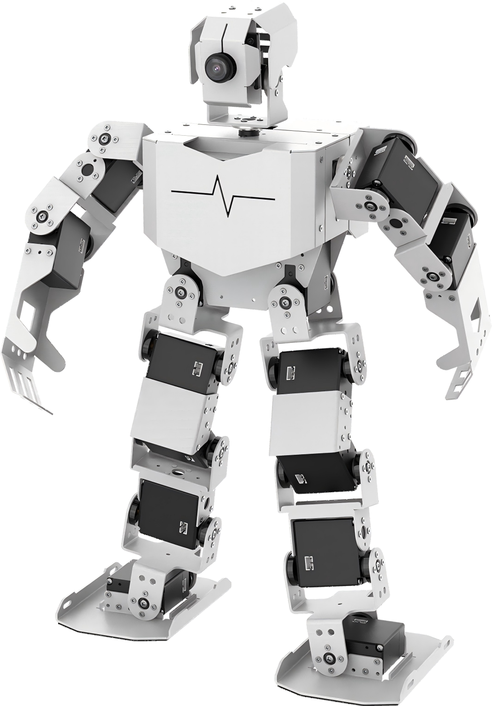
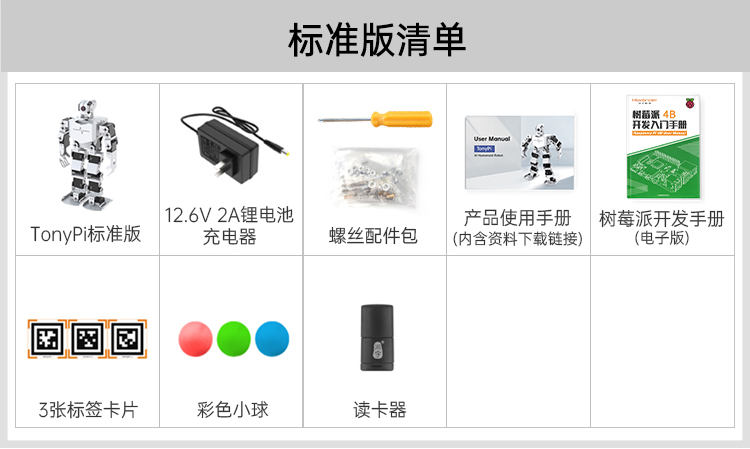
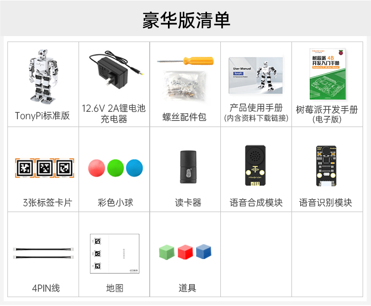
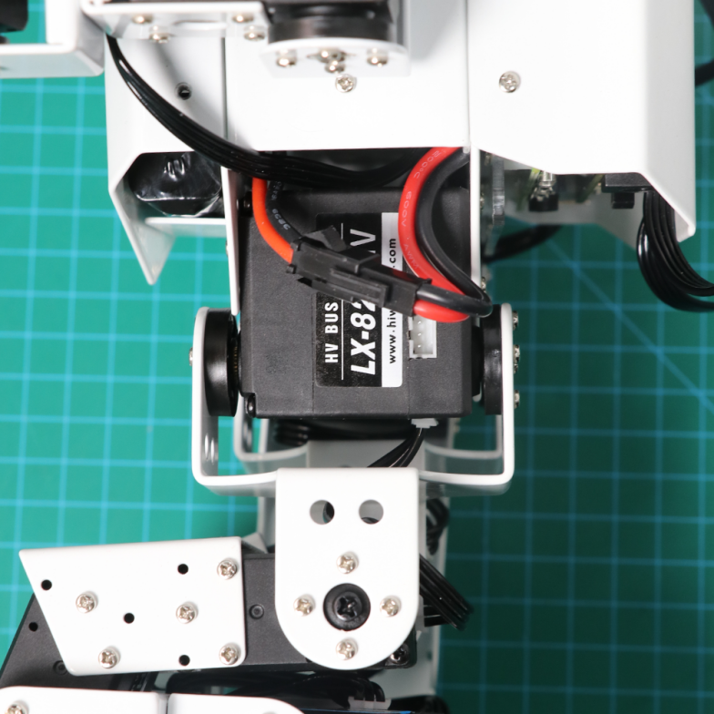
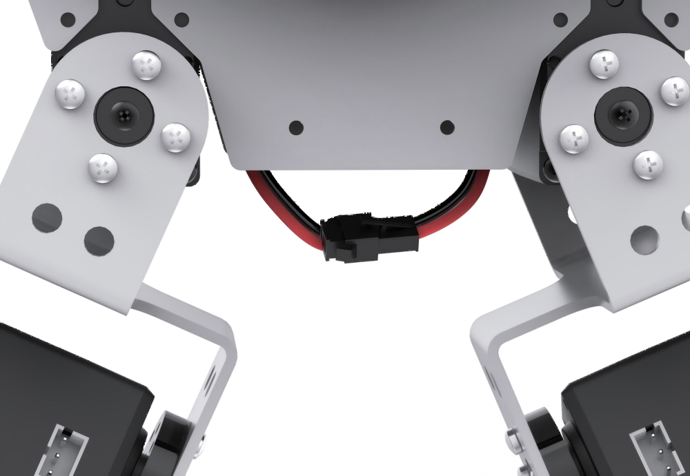

# 学前先看

## 1. 认识TonyPi

### 1.1 产品简介

TonyPi 智能视觉人形机器人以树莓派 5 为主控，OpenCV 为图像处理库，采用 Python语言编程。

它搭载 2 自由度高清晰度广角摄像头，能完成人脸识别、颜色识别、标签识别、自动踢球、视觉巡线等多种 AI 智能玩法。在这个视觉人形机器人平台上，用户可以学习机器视觉、OpenCV、机器人技术等知识。

### 1.2 产品清单

## 2. 首次开机

**由于运输途中锂电池必须断电，所以用户在拿到机器人后需要先将电池对接线进行对接，然后再充电，在充电完成后才可进行首次开机。**

### 2.1 充电方法

:::{Note}
充电前请检查对接线是否对接，电池对接线请以红对红、黑对黑形式进行对接。
:::

(1) 将充电器的插头端连接机器人背部树莓派扩展板的圆孔内，如下图所示：

(2) 充电器指示灯在未通电的状态下为绿色，通电后指示灯为红色代表充电中（充电时长约为3个小时左右），当指示灯由红色变为绿色代表充电完成。充电完成后，请尽快拔掉充电器，切勿一直充电！

### 2.2 开关机

(1) 将机器人背面底部的树莓派扩展板开关由"**OFF**"推动到"**ON**"，此时扩展板的LED1、LED2将常亮，稍等片刻后LED2由常亮变为每隔2秒闪亮一次，即设备成功开机。

树莓派本身也是电脑，开机启动需要一小段时间，请耐心等待。

(2) 设备开机成功后，蜂鸣器会"嘀"的一声，同时机器人会恢复初始姿态。出厂默认为AP直连模式，并将产生一个以HW开头的热点。

### 2.3 查看电量

TonyPi背部搭载了一个电压显示模块，可实时观察机器人当前电量情况，如下图示：

TonyPi的工作电压范围大小为9V-12.6V，当电量充满时，电压显示模块会显示"**12.6**"，当前电压小于10V时，请及时给机器人充电。

接下来您可前往"**[上手试玩](https://docs.hiwonder.com/projects/TonyPi/en/latest/docs/2.quick_user_experience.html)**"继续学习后续内容。
