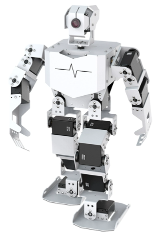
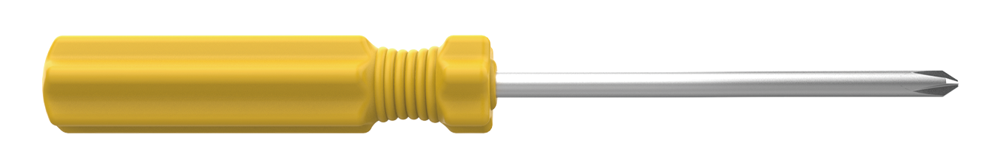
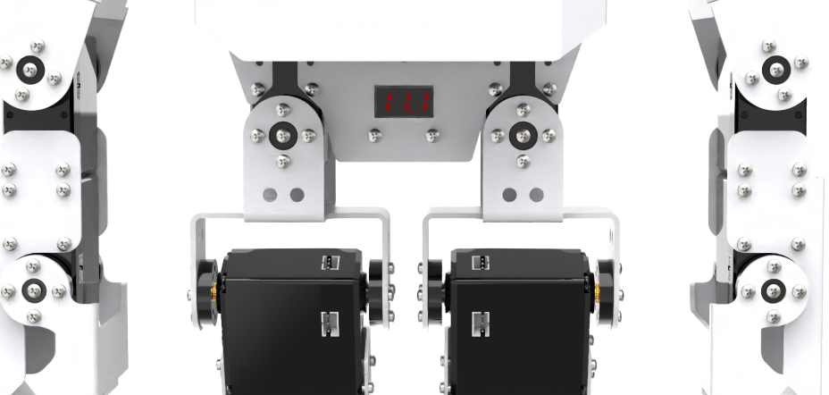

# 1. Getting Ready

## 1.1 TonyPi Instruction

**1.1.1 Introduction**

TonyPi intelligent visual humanoid robot uses Raspberry Pi as the central controller. The image processing library is OpenCV and the programming language is Python.

Equipped with a 2-DOF high-definition camera, TonyPi is able to realize facial recognition, Color recognition, Auto shooting, Vision line follow，Tag recognition and etc. In this robot platform, uses can learn robot vision, OpenCV, robot technology and other knowledge.

**1.1.2 Usage Precautions**

(1) Please pay attention to the following points when using and storing this product:

(2) This product contains conductive components. Avoid contact with metal objects when powered on.

(3) After the robot is powered on, do not forcibly move the servo, as this may cause damage.

(4) If the robot runs for an extended period, the servos may become hot. Allow the robot to "rest" and wait for the servos to cool before resuming operation.

(5) Keep your face, glasses, and other body parts away from the robot while it is operating. Do not place fingers within the joint movement range to prevent injury. Also, be cautious of falls from high edges.

(6) The robot's servos are precision components and consumable parts. They may need replacement after long-term or intensive use.

(7) If the product will not be used for an extended period, fully charge the battery, remove it, and store it in a cool, dry place.

**1.1.3 Copyright Notice**

This manual is the property of Shenzhen Hiwonder Technology Co., Ltd. No organization or individual is permitted to reproduce, copy, translate, or distribute any content from this manual without authorization.

Any unauthorized use or infringement of this manual's copyright will be subject to legal action by our company.

**1.1.4 Disclaimer**

The product described in this manual (including hardware, software, etc.) is provided "as is." Every effort has been made to ensure the accuracy of this manual, but we cannot guarantee it is completely free from errors or omissions. This document is regularly reviewed, and we welcome feedback for improvements.

Product features and specifications may change with version upgrades. For the latest product information, please contact customer service when placing your order.

Furthermore, unless explicitly stated by Hiwonder, we are not responsible for any losses resulting from product malfunctions or damage under extreme conditions outside of typical use cases.

## 1.2 Package List

**(1) Standard Kit**

<table class="docutils-nobg" border="1" style="text-align:center;">
  <thead>
    <tr>
      <th style="text-align: center;">No.</th>
      <th style="text-align: center;">Product Name</th>
      <th style="text-align: center;">Quantity</th>
      <th style="text-align: center;">Picture</th>
    </tr>
  </thead>
  <tbody>
    <tr>
      <td>1</td>
      <td>TonyPi(Ready to use)</td>
      <td>1</td>
      <td></td>
    </tr>
    <tr>
      <td>2</td>
      <td>12.6V Lipo battery charger</td>
      <td>1</td>
      <td></td>
    </tr>
    <tr>
      <td>3</td>
      <td>Balls</td>
      <td>3</td>
      <td></td>
    </tr>
    <tr>
      <td>4</td>
      <td>Tags</td>
      <td>3</td>
      <td></td>
    </tr>
    <tr>
      <td>5</td>
      <td>Card Reader</td>
      <td>1</td>
      <td></td>
    </tr>
    <tr>
      <td>6</td>
      <td>Screwdriver</td>
      <td>1</td>
      <td></td>
    </tr>
    <tr>
      <td>7</td>
      <td>Accessory Bag   (M2*4 Round head screw * 5 M2*6 round head screw * 5 M3*6 Black round head screw * 2 M2*5 Round head self-tapping screw * 5 M2*6 Round head self-tapping screw * 5 A3*5*7 Round head cross-recessed washer-equipped self-tapping screw * 2 M2 nut * 5 10cm 3pin wire * 1 20cm 3pin wire * 1 Main plastic steering wheel * 2 Auxiliary plastic steering wheel * 2)</td>
      <td>1</td>
      <td></td>
    </tr>
    <tr>
      <td>8</td>
      <td>User Manual</td>
      <td>1</td>
      <td></td>
    </tr>
  </tbody>
</table>

**(2) Advanced Kit**

<table class="docutils-nobg" border="1" style="text-align:center;">
  <thead>
    <tr>
      <th style="text-align: center;">No.</th>
      <th style="text-align: center;">Product Name</th>
      <th style="text-align: center;">Quantity</th>
      <th style="text-align: center;">Picture</th>
    </tr>
  </thead>
  <tbody>
    <tr>
      <td>1</td>
      <td>TonyPi(Ready to use)</td>
      <td>1</td>
      <td></td>
    </tr>
    <tr>
      <td>2</td>
      <td>12.6V Lipo battery charger</td>
      <td>1</td>
      <td></td>
    </tr>
    <tr>
      <td>3</td>
      <td>Balls</td>
      <td>3</td>
      <td></td>
    </tr>
    <tr>
      <td>4</td>
      <td>Tags</td>
      <td>3</td>
      <td></td>
    </tr>
    <tr>
      <td>5</td>
      <td>Card Reader</td>
      <td>1</td>
      <td></td>
    </tr>
    <tr>
      <td>6</td>
      <td>Screwdriver</td>
      <td>1</td>
      <td></td>
    </tr>
    <tr>
      <td>7</td>
      <td>Sponge Cubes</td>
      <td>3</td>
      <td></td>
    </tr>
    <tr>
      <td>8</td>
      <td>Map</td>
      <td>1</td>
      <td></td>
    </tr>
    <tr>
      <td>9</td>
      <td>Accessory Bag   (M2*4 Round head screw * 5 M2*6 round head screw * 5 M3*6 Black round head screw * 2 M2*5 Round head self-tapping screw * 5 M2*6 Round head self-tapping screw * 5 A3*5*7 Round head cross-recessed washer-equipped self-tapping screw * 2 M2 nut * 5 10cm 3pin wire * 1 20cm 3pin wire * 1 Main plastic steering wheel * 2 Auxiliary plastic steering wheel * 2)</td>
      <td>1</td>
      <td></td>
    </tr>
    <tr>
      <td>8</td>
      <td>User Manual</td>
      <td>1</td>
      <td></td>
    </tr>
  </tbody>
</table>

## 1.3 Charging and Power-On Status Description

**Lithium batteries must be disconnected during transportation. Therefore, users should first connect the battery connector cable upon receiving the robot, then charge it. Only after the charging process is complete can the robot be powered on for the first time.**

**1.3.1 Charging**

:::{Note}
Please check whether the connector cable is properly connected before charging. Connect the red wire to red one and the black wire to black before charging.
:::

(1) Plug the end of the charger to the hole of the Raspberry Pi expansion board on the back as pictured:

(2) The charger indicator will turn green when not powered on, and turns red when powered on to indicate charging (charging time is approximately 3 hours). When the indicator changes from red to green, it means charging is complete. After charging is complete, please unplug the charger as soon as possible. Do not leave it charging continuously!

**1.3.2 Turn on TonyPi**

(1) Switch on Raspberry Pi expansion board on the back. The LED1 and LED2 of the Raspberry Pi will be on firstly and then the LED2 will flash every 2 seconds, which means the robot is turned on successfully.

The Raspberry Pi is a small minicomputer. It usually takes about 1 minute to boot up from the time it is Powered ON, which is normal and expected.

(2) After turning on, Raspberry Pi will emit a "Di" sound and will be in a AP hotspot mode and launch a Wi-Fi hotspot with a network named with the first letters "HW".

**1.3.3 Check Battery Level**

TonyPi is equipped with a voltage display module on its back, allowing users to observe the current battery level of the robot in real time as pictured:

The operating voltage range of TonyPi is 9V to 12.6V. When the battery is fully charged, the voltage display module will show "12.6". When the current voltage is less than 10V, please recharge the robot promptly.