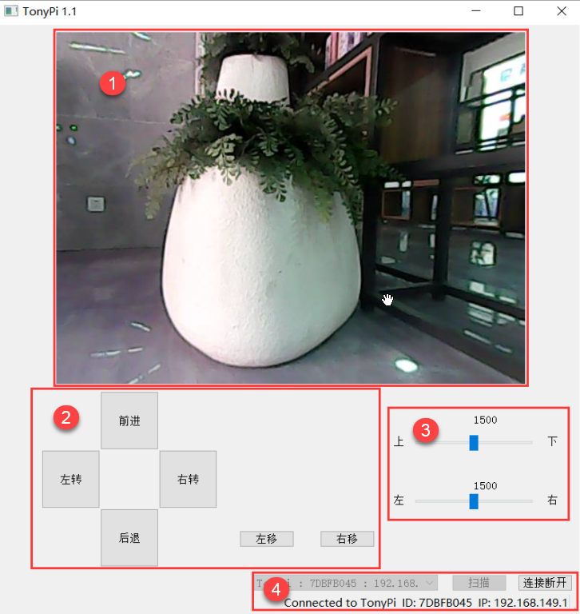
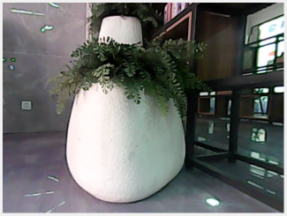
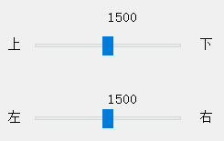

# PC端控制课程

## 1. pc端软件的打开和连接

为了避免操控冲突及出现问题，在使用电脑端控制软件时，请断开手机APP和远程VNC连接。

### 1.1 控制软件打开

在"**[软件工具\6. PC端软件]()**"文件夹下将电脑端控制软件解压至任意英文路径下，然后打开文件夹内的图示应用（**在打开应用时请关闭防火墙**）。

:::{Note}
如果打开后出现下图报错提示，原因通常为文件保存的文件夹含有中文名称。请将本软件内的所有文件放置在英文目录下。
:::

### 1.2 控制软件连接

(1)  打开开关，启动树莓派。

(2)  树莓派在开机成功后，会自动生成一个"**HW**"开头的热点。打开电脑（台式电脑需自备无线网卡）网络设定，选择该热点。

(3)  然后打开控制软件，点击"**扫描**"，等待片刻，扫描结果可在下方图示红框中所看到。

(4)  扫描完成后，点击"**连接**"即可。

## 2. PC端控制演示

(1)  在成功扫描后并连接后，我们进行设备连接。稍等片刻，软件上方会出现摄像头的实时回传画面。

(2)  接下来可以通过点击界面左侧区域的运动按键，控制机器人的移动，主界面分布及功能说明如下所示：

(3)  各区域的功能如下述表格所示：

| **图标** | **功能区** | **功能说明** |
|:--:|:--:|:--:|
|  | **画面回传区** | 显示摄像头回传的画面 |
|  | **机体操控区** | 可进行机体的基本操控 |
|  | **云台操控区** | 可对云台进行操控 |
|  | **连接状态区** | 可对设备产生的热点进行扫描、连接、断开连接 |
