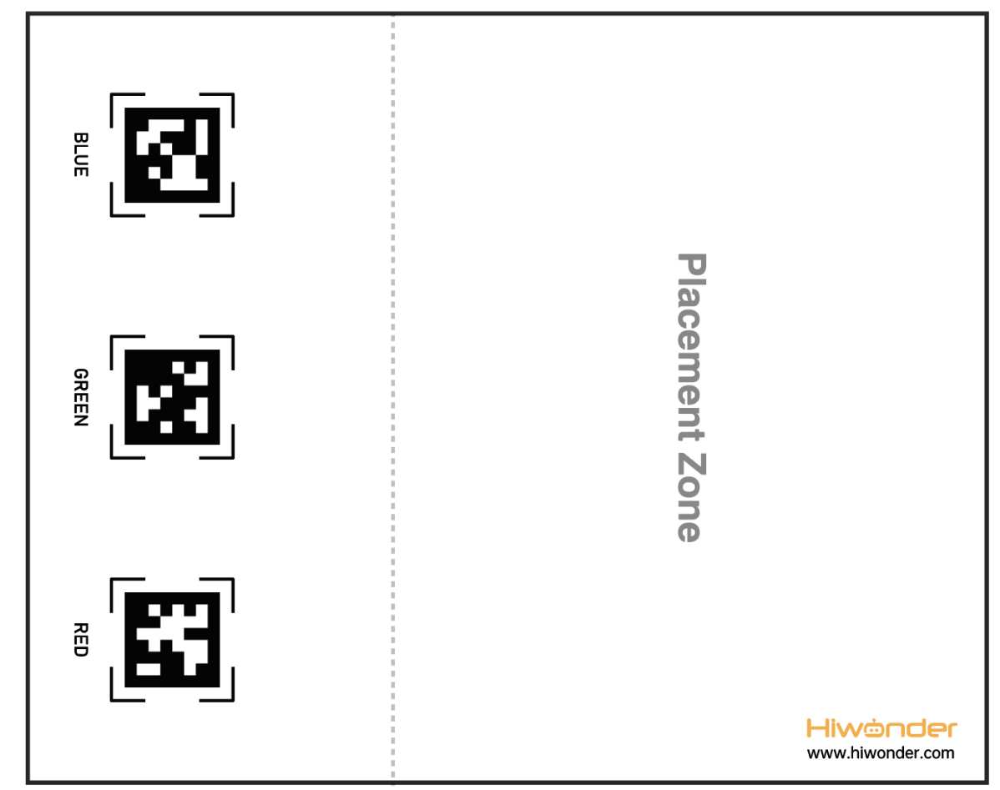
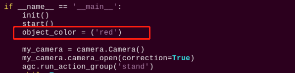
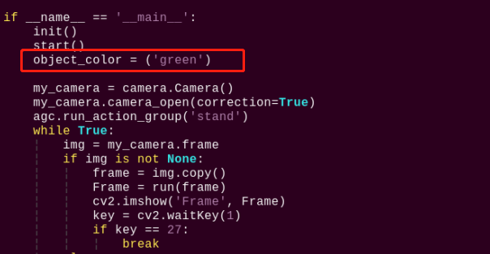
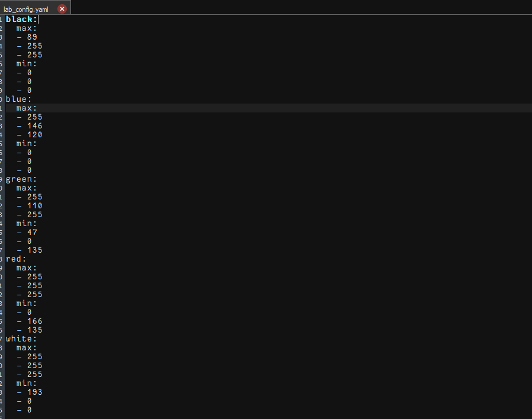
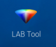
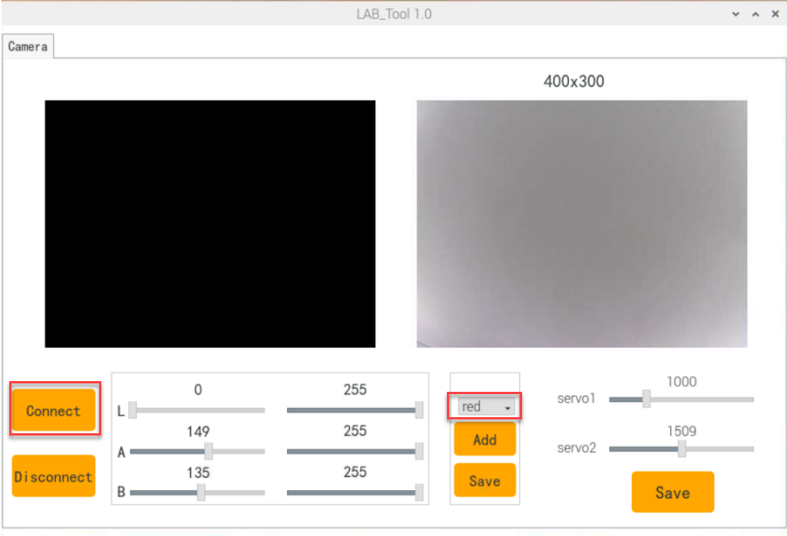
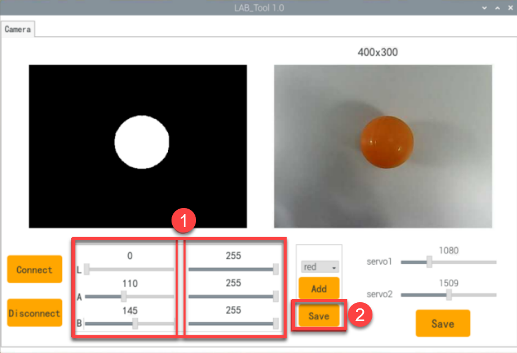

# 7. Intelligent Transport Course

## 7.1 Intelligent Transport

:::{Note}
This section is only applicable to users who have purchased the advanced version. The demonstration effect can be viewed in the folder for this section.
:::

### 7.1.1 Purpose

The robot will sequentially transport sponge blocks on the map to the corresponding AprilTag marker positions until all the blocks are transported.

### 7.1.2 Principle

In the Industry 4.0 era, robots are widely used in the field of intelligent logistics. They can efficiently manage operations, improve the service level of the logistics industry, and consequently reduce costs while decreasing the consumption of natural and social resources.

We are going to learn how TonyPi robot realizes the function of AI Transport in this section. There are two stages: recognition stage and transport stage.

The first stage is recognition. Program TonyPi to search the recognized object on the map through walking and head rotation.

When a recognizable color appears in the visual range, TonyPi starts to process the object color recognition. Convert the image to Lab, image binarization, and then perform operations such as expansion and corrosion to obtain an outline containing only the target color.

The second stage is transport. According to the processing of the image feedback information, TonyPi will judge the distance of the items when multiple items appear. And then move the items according to the distance.Control the robot to approach and, upon reaching the set range, lift the object up to head level.

At the same time, the corresponding AprilTag tag can be matched according to the color of the item, i.e., determining the endpoint position for transporting the item.Then, by controlling the pan-tilt and body movements, scanning is performed on the map. When a tag is detected, different actions are executed based on whether it is the target tag or not.

If the detected tag is the target tag, the robot will directly transport the item to the target point and then place the item down.

If another tag is detected, the robot will determine the position of the target tag based on the detected tag. Then, it will control the robot to turn towards the target until the target tag is scanned. After that, it will transport the item to the target point and place the item down.

### 7.1.3 Preparation

(1) The function of this section should be operated on the provided map. The right side is the items placement zone and the left side is the receiving space.



(2) Place the map on the smooth floor. Place the TonyPi and color blocks in the placement zone.

(3) Turn on robot and connect to Raspberry Pi desktop with VNC.

### 7.1.4 Operation Steps

:::{Note}
Pay attention to the text format in the input of instructions.
:::

(1) Power on the robot and use VNC Viewer to connect to the remote desktop.

(2) Double-click "**Terminator**" icon  in the Raspberry Pi desktop and open command line. 

(3) Input "cd TonyPi/Functions" and press Enter to locate to the directory where the program is stored.

```bash
cd TonyPi/Functions/
```

(4) Input command, then press Enter to start the game.

```bash
python3 Transport.py
```

(5) If you want to exit the game programming, press "Ctrl+C" in the LX terminal interface. If the exit fails, please try it few more times.

### 7.1.5 Project Outcome

:::{Note}
It is recommended to place the map on a flat and open surface for optimal performance.
:::

Place the robot and sponge blocks of red, green, and blue colors randomly within the placement area of the map. After starting the intelligent transportation gameplay, the robot will sequentially transport sponge blocks to the corresponding AprilTag markers based on their proximity until all three blocks are transported.


### 7.1.6 Comparison Between Voice Transport and Intelligent Transport

<table class="docutils-nobg" border="1">
<tbody>
<tr>
<td style="text-align: center;"></td>
<td style="text-align: center;"><strong>Voice control transport</strong></td>
<td style="text-align: center;"><strong>Intelligent transport</strong></td>
</tr>
<tr>
<td rowspan="2" style="text-align: center;">control methods</td>
<td colspan="2" style="text-align: center;">After starting the command-line game</td>
</tr>
<tr>
<td style="text-align: center;">Voice control</td>
<td style="text-align: center;">Auto work</td>
</tr>
<tr>
<td style="text-align: center;">Application scenarios</td>
<td style="text-align: center;">Quiet Environment (Voice commands effective within a distance of less than 30cm)</td>
<td style="text-align: center;">Noisy Environment (No distance requirement) </td>
</tr>
<tr>
<td style="text-align: center;">Work mode</td>
<td style="text-align: center;">Single Transport</td>
<td style="text-align: center;">Continuous Transport</td>
</tr>
</tbody>
</table>

### 7.1.7 Program Parameter Instruction

The source code of this program is located in: ["/home/pi/TonyPi/Functions/Transport.py"](https://store.hiwonder.com.cn/docs/TonyPi/source_code/11/Transport.zip)

* **Transport color and preset position parameters** 

In this game, set up objects of three colors: red, green, and blue, and transport them to their corresponding tag positions, as shown in the pictured:

{lineno-start=134}

```python
color_list = ['red', 'green', 'blue']
```

{lineno-start=68}

```python
# 颜色对应的tag编号(the tag numbers corresponding to each color)
color_tag = {'red': 1,
             'green': 2,
             'blue': 3
             }
```

* **Detect transported object** 

**(1) detect adjustment**

At the beginning, the robot adjusts its left and right direction to find the objects to be transported. The specific settings are as shown in the following image:

{lineno-start=533}

```python
    if not __isRunning or stop_detect:
        if step == 5:
            object_center_x = 0
        elif step == 6:
            find_box = not find_box
            object_center_x = -2
            step = 1
            stop_detect = False
```

{lineno-start=386}

```python
                    # 头回中(return the head to the center)
                    ctl.set_pwm_servo_pulse(1, servo_data['servo1'], 500)
                    ctl.set_pwm_servo_pulse(2, servo_data['servo2'], 500)
                    time.sleep(0.6)
                elif step == 1:  # 左右调整，保持在正中(adjust left and right to stay centered)
                    x_dis = servo_data['servo2']
                    y_dis = servo_data['servo1']                   
                    turn = ''
                    haved_find_tag = False
                    
                    if (object_center_x - CENTER_X) > 170 and object_center_y > 330:
                        AGC.runActionGroup(back, lock_servos=lock_servos)   
                    elif object_center_x - CENTER_X > 80:  # 不在中心，根据方向让机器人转向一步(if not centered, instruct the robot to turn one step in the appropriate direction)
                        AGC.runActionGroup(turn_right, lock_servos=lock_servos)
                    elif object_center_x - CENTER_X < -80:
                        AGC.runActionGroup(turn_left, lock_servos=lock_servos)   
```

**(2) color detection parameter**

To detect the objects for transportation based on their color, the following code is used.

{lineno-start=545}

```python
    color, color_center_x, color_center_y, color_angle = colorDetect(img)  # 颜色检测，返回颜色，中心坐标，角度(color detection, return color, center coordinates, angle)
```

The main process involved in detecting object colors is as follows:

① Before converting the image to the LAB color space, noise reduction processing is required. The "GaussianBlur()" function is used for Gaussian filtering as pictured:

{lineno-start=227}

```python
    frame_gb = cv2.GaussianBlur(frame_resize, (3, 3), 3) 
```

The first parameter `frame_resize` is inputting image.

The second parameter `(3, 3)` is the size of the Gaussian kernel. A larger kernel size typically results in a greater degree of filtering, making the output image more blurry, and it also increases computational complexity.

The third parameter `3` is the standard deviation of the Gaussian function along the X direction. In the Gaussian filter, it is used to control the variation near its mean. If this value is increased, the allowable range of variation around the mean is also increased; if decreased, the allowable range of variation around the mean is reduced.

② By using the `inRange` function to perform binaryzation on the input image as pictured:

{lineno-start=234}

```python
            frame_mask = cv2.inRange(frame_lab,
                                     (lab_data[i]['min'][0],
                                      lab_data[i]['min'][1],
                                      lab_data[i]['min'][2]),
                                     (lab_data[i]['max'][0],
                                      lab_data[i]['max'][1],
                                      lab_data[i]['max'][2]))  #对原图像和掩模进行位运算(operate bitwise operation to original image and mask)
            eroded = cv2.erode(frame_mask, cv2.getStructuringElement(cv2.MORPH_RECT, (3, 3)))  #腐蚀(corrosion)
```

③ To reduce interference and make the image smoother, it is necessary to perform erosion and dilation operations on the image as pictured:

{lineno-start=241}

```python
            eroded = cv2.erode(frame_mask, cv2.getStructuringElement(cv2.MORPH_RECT, (3, 3)))  #腐蚀(corrosion)
            dilated = cv2.dilate(eroded, cv2.getStructuringElement(cv2.MORPH_RECT, (3, 3))) #膨胀(dilation)
```

In the processing, the `getStructuringElement` function is used to generate structuring elements of different shapes.


The first parameter `cv2.MORPH_RECT` is the shape of the kernel, which is a rectangle in this case.

The second parameter `(3, 3)` is the size of the rectangle, which is 3x3 in this case.

④ Find out the largest contour of the object as pictured:

{lineno-start=246}

```python
            if area_max > 500:  # 有找到最大面积(thr maximal area is found)
                rect = cv2.minAreaRect(areaMaxContour)#最小外接矩形(the minimum bounding rectangle)
                angle_ = rect[2]
        
                box = np.int0(cv2.boxPoints(rect))#最小外接矩形的四个顶点(the four vertices of the minimum bounding rectangle)
                for j in range(4):
                    box[j, 0] = int(Misc.map(box[j, 0], 0, size[0], 0, img_w))
                    box[j, 1] = int(Misc.map(box[j, 1], 0, size[1], 0, img_h))

                cv2.drawContours(img, [box], -1, (0,255,255), 2)#画出四个点组成的矩形(draw the rectangle formed by the four points)
```

To avoid interference, the  `if area_max > 500`  instruction is used to ensure that only contours with an area greater than 500 are considered valid for the largest area.

⑤ When the robot detects colored objects, use the `cv2.drawContours()` function to draw the contours of the colored objects as pictured:

{lineno-start=246}

```python
            if area_max > 500:  # 有找到最大面积(thr maximal area is found)
                rect = cv2.minAreaRect(areaMaxContour)#最小外接矩形(the minimum bounding rectangle)
                angle_ = rect[2]
        
                box = np.int0(cv2.boxPoints(rect))#最小外接矩形的四个顶点(the four vertices of the minimum bounding rectangle)
                for j in range(4):
                    box[j, 0] = int(Misc.map(box[j, 0], 0, size[0], 0, img_w))
                    box[j, 1] = int(Misc.map(box[j, 1], 0, size[1], 0, img_h))

                cv2.drawContours(img, [box], -1, (0,255,255), 2)#画出四个点组成的矩形(draw the rectangle formed by the four points)
```

The first parameter `img` is the input image.

The second parameter `[box]` is the contour itself, represented as a list in Python.

The third parameter `-1` is the index of the contour, where the numerical value represents drawing all contours within the list.

The fourth parameter `(0, 255, 255)` is the contour color, with the order being B, G, R, where (0, 255, 255) represents yellow in this case.

The fifth parameter `2` is the contour width. If set to `-1`, it means to fill the contour with the specified color.

⑥ After the robot detects the colored object, use the "cv2.circle()" function to draw the center point of the colored object on the feedback screen as pictured:

{lineno-start=261}

```python
                cv2.circle(img, (center_x_, center_y_), 5, (0, 255, 255), -1)#画出中心点(draw the center point)
```

The first parameter `img` is the input image, which is the image of the detected colored object in this case.

The second parameter `(centerX, centerY)` is the coordinates of the center point of the circle to be drawn (determined based on the detected object).

The third parameter `5` is the radius of the circle to be drawn.

The fourth parameter `(0, 255, 255)` is the color of the circle to be drawn, with the order being B, G, R, and in this case, it represents yellow.

The fifth parameter `-1` indicates that the circle should be filled with the color specified in parameter 4. If it is a number, it represents the line width of the circle to be drawn.

* **Start transporting** 

After detecting a colored object, the robot starts transporting the object, which can be divided into several steps: approaching the object, picking up the object, finding the transportation location, transporting the object, and putting down the object.

**(1) approach the object**

Before starting the transport, first control the robot to gradually approach the object to be transported as pictured:

{lineno-start=547}

```python
    # 如果是搬运阶段(if it is transportation stage)
    if find_box:
        object_color, object_center_x, object_center_y, object_angle = color, color_center_x, color_center_y, color_angle
    else:
        tag_data = apriltagDetect(img) # apriltag检测(apriltag detection)

        if tag_data[color_tag[object_color] - 1][0] != -1:  # 如果检测到目标arpiltag(if the target apriltag is detected)
```

{lineno-start=405}

```python
                        step = 2
                elif step == 2:  # 接近物体(approach the object)
                    if 330 < object_center_y:
                        AGC.runActionGroup(back, lock_servos=lock_servos)
                    if find_box:
                        if object_center_x - CENTER_X > 150:  
                            AGC.runActionGroup(right_move_large, lock_servos=lock_servos)
                        elif object_center_x - CENTER_X < -150:
                            AGC.runActionGroup(left_move_large, lock_servos=lock_servos)                        
                        elif -10 > object_angle > -45:# 不在中心，根据方向让机器人转向一步(if not centered, instruct the robot to turn one step in the appropriate direction)
```

{lineno-start=439}

```python
                elif step == 3:
                    if 340 < object_center_y:
                        AGC.runActionGroup(back, lock_servos=lock_servos)
                    elif 0 < object_center_y <= 250:
                        AGC.runActionGroup(go_forward, lock_servos=lock_servos)
                    elif object_center_x - CENTER_X >= 40:  # 不在中心，根据位置让机器人左右移动一步(if not centered, instruct the robot to turn one step in the appropriate position)
                        AGC.runActionGroup(right_move_large, lock_servos=lock_servos)
                    elif object_center_x - CENTER_X <= -40:
                        AGC.runActionGroup(left_move_large, lock_servos=lock_servos) 
                    elif 20 <= object_center_x - CENTER_X < 40:  
                        AGC.runActionGroup(right_move, lock_servos=lock_servos)
                    elif -40 < object_center_x - CENTER_X < -20: 
```

{lineno-start=454}

```python
                elif step == 4:  #靠近物体(approach the object)
                    if 280 < object_center_y <= 340:
                        AGC.runActionGroup('go_forward_one_step', lock_servos=lock_servos)
                        time.sleep(0.2)
                    elif 0 <= object_center_y <= 280:
                        AGC.runActionGroup(go_forward, lock_servos=lock_servos)
                    else:
                        if object_center_y >= 370:
                            go_step = 2
                        else:
                            go_step = 3
                        if abs(object_center_x - CENTER_X) <= 40:
                            stop_detect = True
```

**(2) pick up the object**

After approaching the object, control the robot to pick up the object to be transported as pictured:

{lineno-start=470}

```python
                elif step == 5:  # 拿起或者放下物体(pick up or put down the object)
                    if find_box:
                        AGC.runActionGroup('go_forward_one_step', times=2)
                        AGC.runActionGroup('stand', lock_servos=lock_servos)
                        AGC.runActionGroup('move_up')
                        lock_servos = LOCK_SERVOS
```

**(3) find the transportation location**

After approaching the object, control the robot to pick up the object to be transported as pictured:

{lineno-start=551}

```python
        tag_data = apriltagDetect(img) # apriltag检测(apriltag detection)
```

The main control parameters involved in the process are as follows:

① After obtaining the information of the four corner points of the tag code, use the "cv2.drawContours()" function to draw the contour of the tag as pictured:

{lineno-start=281}

```python
        for detection in detections:                       
            corners = np.rint(detection.corners)  # 获取四个角点(retrieve the four corner points)
            cv2.drawContours(img, [np.array(corners, int)], -1, (0, 255, 255), 2)
```

② After the robot detects the tag, use the cv2.circle() function to draw the center point of the tag on the feedback screen as pictured:

{lineno-start=}

```python
            object_center_x, object_center_y = int(detection.center[0]), int(detection.center[1])  # 中心点(center point)
            cv2.circle(frame, (object_center_x, object_center_y), 5, (0, 255, 255), -1)
```

**(4) transport object**

After picking up the object, transport the object to the corresponding position as pictured:

{lineno-start=553}

```python
        if tag_data[color_tag[object_color] - 1][0] != -1:  # 如果检测到目标arpiltag(if the target apriltag is detected)
            object_center_x, object_center_y, object_angle = tag_data[color_tag[object_color] - 1]
        else:  # 如果没有检测到目标arpiltag，就通过其他arpiltag来判断相对位置(if the target apriltag is not detected, determine relative position through other apriltag)
```

{lineno-start=470}

```python
                elif step == 5:  # 拿起或者放下物体(pick up or put down the object)
                    if find_box:
                        AGC.runActionGroup('go_forward_one_step', times=2)
                        AGC.runActionGroup('stand', lock_servos=lock_servos)
                        AGC.runActionGroup('move_up')
                        lock_servos = LOCK_SERVOS
```

{lineno-start=536}

```python
        elif step == 6:
            find_box = not find_box
            object_center_x = -2
            step = 1
            stop_detect = False
```

After picking up the object, set "**step = 1**", then control the robot to adjust its left and right position to face the tag position as pictured:

{lineno-start=389}

```python
                    time.sleep(0.6)
                elif step == 1:  # 左右调整，保持在正中(adjust left and right to stay centered)
                    x_dis = servo_data['servo2']
                    y_dis = servo_data['servo1']                   
                    turn = ''
                    haved_find_tag = False
                    
                    if (object_center_x - CENTER_X) > 170 and object_center_y > 330:
                        AGC.runActionGroup(back, lock_servos=lock_servos)   
                    elif object_center_x - CENTER_X > 80:  # 不在中心，根据方向让机器人转向一步(if not centered, instruct the robot to turn one step in the appropriate direction)
```

Then, gradually set "**step = 2**", "**step = 3**", "**step = 4**" to control the robot to transport the object to the tag position as pictured:

{lineno-start=405}

```python
                        step = 2
                elif step == 2:  # 接近物体(approach the object)
                    if 330 < object_center_y:
                        AGC.runActionGroup(back, lock_servos=lock_servos)
                    if find_box:
                        if object_center_x - CENTER_X > 150:  
                            AGC.runActionGroup(right_move_large, lock_servos=lock_servos)
                        elif object_center_x - CENTER_X < -150:
                            AGC.runActionGroup(left_move_large, lock_servos=lock_servos)                        
                        elif -10 > object_angle > -45:# 不在中心，根据方向让机器人转向一步(if not centered, instruct the robot to turn one step in the appropriate direction)
                            AGC.runActionGroup(turn_left, lock_servos=lock_servos)
                        elif -80 < object_angle <= -45:
                            AGC.runActionGroup(turn_right, lock_servos=lock_servos)
                        elif object_center_x - CENTER_X > 40:  
                            AGC.runActionGroup(right_move_large, lock_servos=lock_servos)
                        elif object_center_x - CENTER_X < -40:
                            AGC.runActionGroup(left_move_large, lock_servos=lock_servos)
                        else:
```

{lineno-start=454}

```python
                elif step == 4:  #靠近物体(approach the object)
                    if 280 < object_center_y <= 340:
                        AGC.runActionGroup('go_forward_one_step', lock_servos=lock_servos)
                        time.sleep(0.2)
                    elif 0 <= object_center_y <= 280:
                        AGC.runActionGroup(go_forward, lock_servos=lock_servos)
                    else:
                        if object_center_y >= 370:
                            go_step = 2
                        else:
                            go_step = 3
                        if abs(object_center_x - CENTER_X) <= 40:
                            stop_detect = True
```

During the transportation process, if the target tag is not detected, use other tags to determine the relative position as pictured:

{lineno-start=556}

```python
            turn = getTurn(color_tag[object_color], tag_data)
            if turn == 'None':
                object_center_x, object_center_y, object_angle = -1, -1, 0
            else:  # 完全没有检测到apriltag(if the apriltag is completely not detected)
                object_center_x, object_center_y, object_angle = -3, -1, 0
```

{lineno-start=303}

```python
# 通过其他apriltag判断目标apriltag位置(determine the position of the target AprilTag through other AprilTags)
# apriltag摆放位置：红(tag36h11_1)，绿(tag36h11_2)，蓝(tag36h11_3)(aprilTag placement: red (tag36h11_1), green (tag36h11_2), blue (tag36h11_3))
def getTurn(tag_id, tag_data):
    tag_1 = tag_data[0]
    tag_2 = tag_data[1]
    tag_3 = tag_data[2]

    if tag_id == 1:  # 目标apriltag为1(the apriltag target is 1)
        if tag_2[0] == -1:  # 没有检测到apriltag 2(apriltag 2 is not detected)
            if tag_3[0] != -1:  # 检测到apriltag 3， 则apriltag 1在apriltag 3左边，所以左转(apriltag 3 is detected, in this case, aprilTag 1 is to the left of aprilTag 3, so turn left)
                return 'left'
        else:  # 检测到apriltag 2，则则apriltag 1在apriltag 2左边，所以左转(apriltag 2 is detected, in this case, apriltag 1 is to the left of apriltag 2, so turn left)
            return 'left'
    elif tag_id == 2:
        if tag_1[0] == -1:
            if tag_3[0] != -1:
                return 'left'
        else:
            return 'right'
    elif tag_id == 3:
        if tag_1[0] == -1:
            if tag_2[0] != -1:
                return 'right'
        else:
            return 'right'
```


**(5) put down object**

After completing the transportation, put down the object as pictured:

{lineno-start=470}

```python
                elif step == 5:  # 拿起或者放下物体(pick up or put down the object)
                    if find_box:
                        AGC.runActionGroup('go_forward_one_step', times=2)
                        AGC.runActionGroup('stand', lock_servos=lock_servos)
                        AGC.runActionGroup('move_up')
                        lock_servos = LOCK_SERVOS
                        step = 6    
                    else:
                        AGC.runActionGroup('go_forward_one_step', times=go_step, lock_servos=lock_servos)
                        AGC.runActionGroup('stand', lock_servos=lock_servos)
                        AGC.runActionGroup('put_down')
                        AGC.runActionGroup(back, times=5, with_stand=True)
                        color_list.remove(object_color)
                        if color_list == []:
                            color_list = ['red', 'green', 'blue']
                        lock_servos = ''
```

## 7.2 Object Tracking

### 7.2.1 Program Logic

The robot recognizes colors, and its body can move according to the movement of the target color.

Distinguished from the color tracking effect in "[4.AI Vision Projects](https://docs.hiwonder.com/projects/TonyPi/en/latest/docs/8.ai_vision_games_lesson.html)" here is the effect of the body movement.

First, program TonyPi to recognize colors with Lab color space. Convert the RGB color space to Lab, image binarization, and then perform operations such as expansion and corrosion to obtain an outline containing only the target color. Use circles to frame the color outline to realize object color recognition.

Next, the traversal algorithm compares all correctly recognized colored objects and selects the object with the largest contour area as the target.

Finally, the servo is called to perform real-time tracking, while the body is driven to perform follow-up actions through action groups, thus completing the object tracking function.

The source code of the program is located in: [/home/pi/TonyPi/Functions/Follow.py](https://store.hiwonder.com.cn/docs/TonyPi/source_code/11/Follow.zip)

### 7.2.2 Operation Steps

:::{Note}
Instructions must be entered with strict attention to case sensitivity and spacing.
:::

(1) Turn on robot and connect to Raspberry Pi desktop with VNC.

(2) Double-click "**Terminator**" icon  in the Raspberry Pi desktop and open command line. Then input "cd TonyPi/Functions/" and press Enter to locate the directory where the program is stored.

```bash
cd TonyPi/Functions/
```

(3) Input command "python3 Follow.py", then press Enter to start the game.

```bash
python3 Follow.py
```

(4) If you want to exit the game programming, press "**Ctrl+C**". If the exit fails, please try it few more times.

### 7.2.3 Project Outcome

After the gameplay is started, slowly move the red sponge block by hand or place the block on a movable carrier. The TonyPi robot will move along with the movement of the target color.
### 7.2.4 Programming Instruction

The source code of this program is locate in: [/home/pi/TonyPi/Functions/Follow.py](https://store.hiwonder.com.cn/docs/TonyPi/source_code/11/Follow.zip)

* **Import parameter module** 

| **Import module** | **function**                                                                                                                                       |
|:--:|:---------------------------------------------------------------------------------------------------------------------------------------------------|
| import sys | The Python "sys" module has been imported for accessing system-related functions and variables.                                                    |
| import os | The Python "os" module has been imported, providing functions and methods for interacting with the operating system.                               |
| import cv2 | The OpenCV library has been imported for image processing and computer vision-related functionalities                                              |
| import time | The Python "time" module has been imported for time-related functionalities, such as delay operations.                                             |
| import math | The "math" module provides low-level access to mathematical operations, including many commonly used mathematical functions and constants.         |
| import threading | Provides an environment for running multiple threads concurrently.                                                                                 |
| import np | The NumPy library has been imported. It is an open-source numerical computing extension for Python, used for handling array and matrix operations. |
| import hiwonder.TTS as TTS | Import speech recognition library                                                                                                                  |
| import hiwonder.Camera as Camera | Import camera library                                                                                                                              |
| from hiwonder.Misc import Misc | The "Misc" module has been imported for handling recognized rectangular data.                                                                      |
| import hiwonder.ros_robot_controller_sdk as rrc | The robot's underlying control library has been imported for controlling servos, motors, RGB lights, and other hardware.                           |
| from hiwonder.controller import Controller | Import action group execution library                                                                                                              |
| import hiwonder.ActionGroupControl as AGC | Import action group execution library                                                                                                              |
| import common.yaml_handle | Contains functionalities or tools related to processing YAML format files.                                                                         |

* **Color detection parameter** 

In the object tracking program, the detected object color is red.

{lineno-start=287}

```python
if __name__ == '__main__':
    init()
    start()
    __target_color = ('red')
```

The main detection parameters involved in the detection process are as follows:

(1) Before converting the image to the LAB color space, noise reduction processing is required. The `GaussianBlur()` function is used for Gaussian filtering as pictured:

{lineno-start=205}

```python
    frame_gb = cv2.GaussianBlur(frame_resize, (3, 3), 3)   
```

The first parameter `frame_resize` is inputting image.

The second parameter `(3, 3)` is the size of the Gaussian kernel. A larger kernel size typically results in a greater degree of filtering, making the output image more blurry, and it also increases computational complexity.

The third parameter `3` is the standard deviation of the Gaussian function along the X direction. In the Gaussian filter, it is used to control the variation near its mean. If this value is increased, the allowable range of variation around the mean is also increased; if decreased, the allowable range of variation around the mean is reduced.

(2) By using the `inRange` function to perform binaryzation on the input image as pictured:

{lineno-start=213}

```python
            frame_mask = cv2.inRange(frame_lab,
                                     (lab_data[i]['min'][0],
                                      lab_data[i]['min'][1],
                                      lab_data[i]['min'][2]),
                                     (lab_data[i]['max'][0],
                                      lab_data[i]['max'][1],
                                      lab_data[i]['max'][2]))  #对原图像和掩模进行位运算(operate bitwise operation to original image and mask)
```

(3) To reduce interference and make the image smoother, it is necessary to perform erosion and dilation operations on the image as pictured:

{lineno-start=220}

```python
            eroded = cv2.erode(frame_mask, cv2.getStructuringElement(cv2.MORPH_RECT, (3, 3)))  #腐蚀(corrosion)
            dilated = cv2.dilate(eroded, cv2.getStructuringElement(cv2.MORPH_RECT, (3, 3))) #膨胀(dilation)
```

In the processing, the `getStructuringElement` function is used to generate structuring elements of different shapes.

The first parameter `cv2.MORPH_RECT` is the shape of the kernel, which is a rectangle in this case.

The second parameter `(3, 3)` is the size of the rectangle, which is 3x3 in this case.

(4) Find out the largest contour of the object as pictured:

{lineno-start=223}

```python
            areaMaxContour, area_max = getAreaMaxContour(contours)  # 找出最大轮廓(find out the contour with the largest area)
    if areaMaxContour is not None and area_max > 100:  # 有找到最大面积(the maximal area is found)
        rect = cv2.minAreaRect(areaMaxContour)#最小外接矩形(the minimum bounding rectangle)
        box = np.int0(cv2.boxPoints(rect))#最小外接矩形的四个顶点(the four vertices of the minimum bounding rectangle)
```

To avoid interference, the  `if area_max_contour is not None and area_max > 100`  instruction is used to ensure that only contours with an area greater than 100 are considered valid for the largest area.

* **Color recognition parameter** 

The main control parameters involved in the color recognition process are as follows:

(1) When the robot detects a colored object, use the `cv2.drawContours()` function to draw the contour of the colored object as pictured:

{lineno-start=231}

```python
        cv2.drawContours(img, [box], -1, (0,255,255), 2)#画出四个点组成的矩形(draw the rectangle formed by the four points)
```

The first parameter `img` is inputting image.

The second parameter `[box]` is the contour itself, represented as a list in Python.

The third parameter `-1` is the index of the contour, where the numerical value represents drawing all contours within the list.

The fourth parameter `(0, 255, 255)` is the contour color, with the order being B, G, R, and in this case, it represents yellow.

The fifth parameter `2` is the contour width. If set to `-1`, it means to fill the contour with the specified color.

(2) After the robot detects a colored object, use the `cv2.circle()` function to draw the center point of the colored object on the feedback screen as pictured:

{lineno-start=237}

```python
        cv2.circle(img, (centerX, centerY), 5, (0, 255, 255), -1)#画出中心点(draw the center point)
```

The first parameter `img` is the input image, which is the image of the detected colored object in this case.

The second parameter `(centerX, centerY)` is the coordinates of the center point of the circle to be drawn (determined based on the detected object).

The third parameter `5` is the radius of the circle to be drawn.

The fourth parameter `(0, 255, 255)` is the color of the circle to be drawn, with the order being B, G, R, and in this case, it represents yellow.

The fifth parameter `-1` indicates that the circle should be filled with the color specified in parameter 4. If it is a number, it represents the line width of the circle to be drawn.

* **Perform motion parameter** 

(1) After detecting a red object, control servo 1 and servo 2 of the robot to move the upper camera with the movement of the red object.

{lineno-start=256}

```python
        # 计算使用时间(calculate use time)
        use_time = abs(dx*0.00025)
        x_dis += dx #输出(output)
        
        # 将控制头部水平移动的舵机位置限制在预设范围内(limit the position of the servo controlling horizontal movement of the head within a predefined range)
        x_dis = servo_data['servo2'] - 400 if x_dis < servo_data['servo2'] - 400 else x_dis          
        x_dis = servo_data['servo2'] + 400 if x_dis > servo_data['servo2'] + 400 else x_dis

        # 设置垂直舵机位置PID的目标值为图像高度的一半(set the target value of the PID for the vertical servo position to half of the image height)
        y_pid.SetPoint = img_h/2
        y_pid.update(centerY)
        dy = int(y_pid.output)
        # 计算使用时间(calculate use time)
        use_time = round(max(use_time, abs(dy*0.00025)), 5)
        y_dis += dy
        
        # 将控制头部垂直移动的舵机位置限制在预设范围内(limit the position of the servo controlling vertical movement of the head within a predefined range)
        y_dis = servo_data['servo1'] if y_dis < servo_data['servo1'] else y_dis
        y_dis = 2000 if y_dis > 2000 else y_dis    
        
        ctl.set_pwm_servo_pulse(1, y_dis, use_time*1000)
        ctl.set_pwm_servo_pulse(2, x_dis, use_time*1000)

        time.sleep(use_time)
    else:
        centerX, centerY = -1, -1
```

Take code `ctl.set_pwm_servo_pulse(1, vertical_servo_position,use_time*1000)` as example:

The first parameter `1` represents controlling servo ID 1.

The second parameter `vertical_servo_position` represents the pulse width of servo ID 1.

The third parameter `use_time*1000` represents the movement time of the servo, in milliseconds.

(2) After detecting the red ball, the robot calls the action group file in the `/home/pi/TonyPi/ActionGroups` directory to control the robot to move along with the red object as pictured:

{lineno-start=167}

```python
#执行动作组(perform action group)
def move():
    
    while True:
        if __isRunning:
            if centerX >= 0:
                if centerX - CENTER_X > 100 or x_dis - servo_data['servo2'] < -80:  # 不在中心，根据方向让机器人转向一步(if not centered, instruct the robot to turn one step in the appropriate direction)
                    AGC.runActionGroup('turn_right_small_step')
                elif centerX - CENTER_X < -100 or x_dis - servo_data['servo2'] > 80:
                    AGC.runActionGroup('turn_left_small_step')                        
                elif 100 > circle_radius > 0:
                    AGC.runActionGroup('go_forward')
                elif 180 < circle_radius:
                    AGC.runActionGroup('back_fast')
            else:
                time.sleep(0.01)
        else:
            time.sleep(0.01)
```

### 7.2.5 Function Extension

* **Modify Default Recognition Color** 

Blue, red and green are the built-in colors in the motion tracking program and red is the default color. In the following steps, we’re going to modify the tracking color as green.

(1) Enter command "cd TonyPi/Functions/" to the directory where the game program is located.

```bash
cd TonyPi/Functions/
```

(2) Enter command "vim Follow.py" to go into the game program through vi editor.

```bash
vim Follow.py
```

(3) Find the code `object_color = ('red')`.



:::{Note}
After entering the code position number on the keyboard, press "Shift+G" to directly locate to the corresponding location. This section aims to introduce quick location methods, so the code position number is for reference only. Please rely on actual positions.
:::

(4) Press "**i**" to enter the editing mode, then modify red in "_target_color = (‘red’)" to green.



(5) Press "**Esc**" to enter last line command mode. Input "**:wq**" to save the file and exit the editor.

```bash
:wq
```

* **Add Recognized Color** 

In addition to the built-in recognized colors, you can set other recognized colors in the programming. Take orange as example:

(1) Open VNC, input command "vim  TonyPi/lab_config.yaml" to open Lab color setting document.

```bash
vim lab_config.yaml
```

It is recommended to use screenshot to record the initial value.



(2) Click the debugging tool icon in the system desktop. Choose "**Run**" in the pop-up window.



(3) Click "**Connect**" button in the lower left hand. When the interface display the camera returned image, the connection is successful. Select "red" in the right box first.



(4) Drag the corresponding sliders of L, A, and B until the color area to be recognized in the left screen becomes white and other areas become black.

For example, if you want to recognize orange, you can put the orange ball in the camera's field of view. Adjust the corresponding sliders of L, A, and B 

until the blue part of the left screen becomes white and other colors become black, and then click " Save" button to keep the modified data.



For the game’s performance, it’s recommended to use the LAB_Tool tool to modify the value back to the initial value after the modification is completed.

(5) After the modification is completed, check whether the modified data was successfully written in. Enter the command again "vim TonyPi/lab_config.yaml" to check the color setting parameters.

```bash
vim lab_config.yaml
```


(6) Check the data in red frame. If the edited value was written in the program, press "Esc" and enter ":wq" to save it and exit.

```bash
:wq
```

(7) The default tracking color can be set as black according to the "[7.2.5 Function Extension -> Modify Default Tracking Color]()" in this text.
