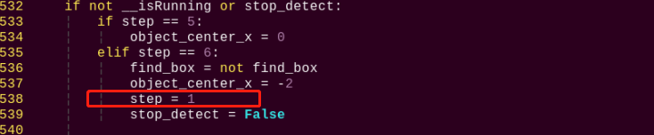
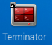

# 语音交互及智能搬运课程

## 1. 语音模块的安装与接线

(1) 肩部亚克力安装

<p style="text-align: center;">
    <video  controls controlslist="nodownload" width="100%" height="auto" src="https://store.hiwonder.com.cn/uploads/20210303/luNEBdojKY3HYJ6YbdOguT_68xfM/1.肩部亚克力安装.mp4" data-setup="{}"></video>
</p>
<br>

(2) 模块安装

<p style="text-align: center;">
    <video controls controlslist="nodownload" width="100%" height="auto" src="https://store.hiwonder.com.cn/uploads/20210303/lspm-eHchEAqNFz9KTe_A9PG2MmE/2.模块安装.mp4" data-setup="{}"></video>
</p>
<br>

(3) 模块接线

<p style="text-align: center;">
    <video  controls controlslist="nodownload" width="100%" height="auto" src="https://store.hiwonder.com.cn/uploads/20210303/lurl6jqHnWFhrP9lbufZ-S6SMMUw/3.模块接线.mp4" data-setup="{}"></video>
</p>
<br>

## 2. 语音控制TonyPi

### 2.1 玩法简要说明

通过指定的语音词条来对机器人发出控制，机器人执行对应的动作。 

语音控制是一种有效便捷的控制方式，让机器人能够"**听懂**"人类的语言，并能做出正确的反馈是我们当前人机的交互目标。

下面我们来看一下本节功能的实现流程：

首先，我们需要导入一些必要的库，例如TonyPi动作组库。接着，开启语音识别模块的功能（即ASR）对语言指令进行收集、解析。然后通过TTS技术，对收集的指令做出反馈，并运行相关动作组，从而实现语音控制的效果。

### 2.2 玩法开启及关闭

(1) 将机器人开机，然后通过VNC远程连接树莓派桌面。关于VNC的安装及连接，可参考"**[远程工具安装及连接\1. 远程工具安装与连接](https://docs.hiwonder.com/projects/TonyPi/en/latest/docs/6.remote.html#id2)**"。

(2) 在树莓派的桌面单击左上角的的图标（如下图所示位置），或按住快捷Ctrl+Alt+T， 打开 LX 终端。


(3) 输入指令，按下回车键，则定位到存放了玩法程序的目录。

```bash
cd TonyPi/Functions/
```

(4) 输入指令，然后按下回车键将玩法启动。

```c
python3 ASRControl.py
```

(5) 如需关闭此玩法，只需要在 LX 终端界面中按下"**Ctrl+C**"。如果关闭失败，可多次按下。

### 2.3 实现效果

靠近语音识别模块的麦克风，先说唤醒词"**开始**"。当模块上的 STA 指示灯变为蓝色常亮时，再说其它词条，例如"**qianjin（前进）**"、"**xianghoutui（向后退）**"等。

当识别到后，语音识别模块上的 STA 指示灯会熄灭，语音播报模块将播放"**收到**"的声音作为反馈，然后机器人便进行执行一次对应的动作。

动作执行完后我们可以继续说出其它词条继续操控（注意每次必须先说"**开始**"来唤醒TonyPi）。

程序内置的词条如下表所示：

| **序号** |   **唤醒词**   |
| :------: | :------------: |
|    1     | kaishi（开始） |


<table class="docutils-nobg" border="1">
<tbody>
<tr>
<td style="text-align: center;">序号</td>
<td style="text-align: center;"><strong>关键字</strong></td>
</tr>
<tr>
<td rowspan="3" style="text-align: center;"><strong>2</strong></td>
<td style="text-align: center;">wang qian zou（往前走）</td>
</tr>
<tr>
<td style="text-align: center;">qian jin（前进）</td>
</tr>
<tr>
<td style="text-align: center;">zhi zou （直走</td>
</tr>
<tr>
<td style="text-align: center;"><strong>3</strong></td>
<td style="text-align: center;">wang hou tui（往后退）</td>
</tr>
<tr>
<td style="text-align: center;"><strong>4</strong></td>
<td style="text-align: center;">xiang zuo yi（向左移）</td>
</tr>
<tr>
<td style="text-align: center;"><strong>5</strong></td>
<td style="text-align: center;"> xiang you yi（向右移）</td>
</tr>
</tbody>
</table>


### 2.4 功能延伸

- #### 2.4.1 语音识别模块

(1) **增加或修改检测词条**

**本小节以新增一个鞠躬的词条为例进行展开：**

① 程序中内置了5个词条，词条asr.addWords(1, 'kai shi')中的第一个参数是词条的编号，词条的编号需要随着词条数量进行手动依次增加；第二个参数是词条的内容，这里需要将识别的内容以拼音的形式进行添加，汉字拼音之间以空格隔开。

例如："**ni hao**"为正确的，"**nihao**"为错误。

② 在添加词条时，需要注意：最多可以设置50个词条识别句，词条识别句可以是单字，词组或短句，每句长度为不超过10个汉字或者79个字节的拼音串。


③ 如需增加或修改词条，只需按照前面词条的格式进行添加或修改就可以了。


:::{Note}
这里只是增加了一个语音识别的新词条，在识别后并无任何执行动作。如需加入识别后的动作，请详细参考源码程序注释。
:::

(2) **修改唤醒词条**

**本小节将唤醒词条修改为"准备"为例进行展开：**

① 程序中默认为口令模式。在口令模式下，每次执行语音识别，都需要先说出唤醒的词条，再接着说出检测的词条，机器人才会执行检测词条对应的动作。


② 程序设置词条的第一个词条作为启动语音识别的唤醒词条。

③ 如果需要修改唤醒的词条，直接将第一个词条内容修改即可。例如：我们将唤醒词修改为准备，可参考下图：


(3) **修改识别模式**

语音识别模块支持 3 种语音识别模式，分别是循环识别模式、口令模式、按键模式。

① 循环模式是让语音识别模块一直循环检测词条；

② 口令模式是每次检测前，都需要说出第一个词条作为启动检测的口令，然后再说出检测的词条；

③ 按键模式是只有按下语音识别模块上的按键，才会开始检测词条；

④ 程序中默认设置为口令模式，即 asr.setMode()的值为 2。如果要修改语音识别的模式，可以在程序中如下位置进行修改：


⑤ 如果要设置为循环模式，需要将 asr.setMode()值修改为 1；如果要设置为按键模式，需要将 asr.setMode()值修改为 3。

- #### 2.4.2  语音合成模块
(1) **修改播放内容**

① 程序默认播放内容是"**准备就绪**"，如下图所示：


② 如需修改播放的内容，直接修改文本的内容即可，例如我们修改为"**你好TonyPi**"，如下图所示：


(2) **修改播放音量**

① 程序中默认的音量是最大音量10，如下图所示：


② 如需修改音量，直接修改\[v10\]中的数值即可，例如我们修改为"**\[v5\]**"，如下图所示：

:::{Note}
音量范围为0-10。
:::


因篇幅展示受限，更多参数可参考本节所在目录附带的"**语音合成模块更多说明**"。

### 2.5 程序简要分析

[下载源代码](https://store.hiwonder.com.cn/docs/TonyPi/source_code/11/ASRControl.py)

(1) **导入参数模块**

| **导入模块** | **作用** |
|:--:|:--:|
| import sys | 导入了Python的sys模块，用于访问系统相关的功能和变量 |
| import os | 导入Python的os模块，提供了与操作系统交互的函数和方法 |
| import cv2 | 导入了OpenCV库，用于图像处理和计算机视觉相关的功能 |
| import time | 导入了Python的time模块，用于时间相关的功能，例如延时操作 |
| import math | math模块提供了对数学运算的底层访问，包含了许多常用的数学函数和常量 |
| import threading | 提供多线程运行的环境 |
| import np | 导入NumPy库，是Python的一个开源数值计算扩展库，用于处理数组和矩阵运算 |
| import common.action_group_control as agc | \#上位机编辑的动作调用库 |
| import sensor.camera as camera | 导入相机库 |
| from common import misc | 导入了Misc模块，用于处理识别得到的矩形数据 |
| import common.ros_robot_controller_sdk as rrc | 导入机器人底层控制库，用于控制舵机、电机、RGB灯等硬件 |
| import common.yaml_handle | 包含一些与处理YAML格式文件相关的功能或工具 |
| from common.controller import Controller | 导入了运动控制库 |

根据实现效果，梳理该玩法的实现逻辑如下图所示：

(2) **功能逻辑**

通过唤醒词，唤醒TonyPi根据语音识别词条判断需要执行的动作组，并且执行相对应的动作组。

(3) **程序逻辑及对应的代码分析**

**① 语音识别及合成参数**

在这个玩法中，语音识别模块负责识别外界声音，语音合成模块负责输出声音，过程中涉及的主要参数如下：

- 初始时，需设置唤醒词和控制语音，如下图所示：


以"**asr.addWords(1, 'kai shi')**"为例：

第一个参数"**1**"是控制语音序号，1默认设置为唤醒词；

第二个参数"**'kai shi'**"是控制语音的中文拼音。

- 通过语音合成模块发出声音，如下图所示：


第一个参数"**"\[h0\]\[v10\]\[m3\]"**"是控制发声的方法，\[h0\]设置单词发音方式，0表示自动判断单词发音方式，1表示字母发音方式，2表示单词发音方式；

\[v10\]设置音量，音量范围为0-10，10为最大音量；

:::{Note}
\[m3\]为音色，默认为女声，且不支持更改。
:::

第二个参数"**"准备就绪"**"是语音合成模块输出声音内容。

**② 执行动作参数**

当接收到语音信息，语音合成模块输出对应的声音，同时机器人执行对应动作，具体设置如下图所示：


设置时，语音控制指令所对应的序号，如下图所示：


在"**ActionGroupDict.py**"代码中，同样给对应动作组编号，如下图所示：


通过AGC.runActionGroup函数中"**action_group_dict\[str(data - 1)\]**"参数，设置控制语音对应序号减1，就对应运行的动作组编号。例如，控制语音为向左转移，序号为4，执行的动作组编号为3，就是"**left_move_fast.d6a**"动作组。

## 3. 颜色识别播报

### 3.1 玩法简要说明

通过机器人识别不同的颜色，语音合成模块会播报对应的名称。

TTS（文语转换技术），又称之为语音合成技术，它能够将计算机产生的、或外部输入的文字信息转变为可以听得懂的语音输出。对常见的数字、号码、时间、日期、度量符号等信息，能够根据内部的文本匹配规则进行正确的识别和处理。

本节课我们让机器人识别不同颜色，并且通过语音合成模块播报作为反馈。

首先对视觉范围内的图像进行处理，将图像转换为Lab空间，进行二值化处理，再经过膨胀腐蚀等操作，可获得只包含目标颜色的轮廓，然后将该颜色轮廓框起，便实现了物体颜色的识别。

语音合成功能支持多种文本控制标记，可以设置发音人、音量、语速、语调等参数，模拟真人发生的效果。

当获得颜色识别结果后，语音合成需对颜色的判断，根据判断结果设置不同的语音参数。然后再通过对颜色的文本数据进行处理，与语音库进行匹配，将文本转换为音素序列，再将音素序列生成语音。

最后输出结果，从而达到颜色识别播报的功能。

### 3.2 玩法开启及关闭

:::{Note}
指令的输入需严格区分大小写及空格。
:::

(1)  将机器人开机，然后通过VNC远程连接树莓派桌面。关于VNC的安装及连接，可参考"**[远程工具安装及连接\1. 远程工具安装与连接](https://docs.hiwonder.com/projects/TonyPi/en/latest/docs/6.remote.html#id2)**"。

(2)  树莓派的桌面双击的"**Terminator**"图标，打开命令行终端。

(3)  输入如下指令 ，按下回车键 ，则定位到存放了玩法程序的目录。

```bash
cd TonyPi/Functions/
```

(4))  输入如下指令，然后按下 "**回车键**" 将玩法启动。

```bash
python3 ColorDetectAndTTS.py
```

(5)  如需关闭此玩法，只需要在LX终端界面中按下 "**Ctrl+C**" 。如果关闭失败，可多次按下。

### 3.3 功能实现

:::{Note}
建议在平整空旷的地面进行操作，并且每次保持仅有单个颜色物品出现在摄像头可识别范围。
:::

当听到机器人播报"**我准备好了**"的语音后，可将不同颜色的物品依次置于摄像头前。当识别到后，便会播报该颜色对应的词条，并且播报音色各不相同。

颜色与词条的关系如下表：

| **颜色** |  **词条**  |
|:--------:|:----------:|
|   红色   | 检测到红色 |
|   绿色   | 检测到绿色 |
|   蓝色   | 检测到蓝色 |

### 3.4 功能延伸

我们可以根据实际情况来修改语音播报的内容以及音量。其中音量的可调节范围为1-10，默认的音量值为10。玩法启动后，默认会播报"**我准备好了**"。

本节我们将音量修改为5，玩法启动后的默认播报修改为"**你好**"为例，具体步骤如下

(1)  输入如下指令，按下回车键 ，则定位到存放了玩法程序的目录。

```bash
cd TonyPi/Functions/
```

(2) 输入如下指令，回车，进入编辑模式。

```bash
vim ColorDetectAndTTS.py
```

(3) 找到代码"**tts.TTSModuleSpeak('\[h0\]\[v10\]\[m3\]', '我准备好了')**"。

:::{Note}
在键盘输入代码位置序号后按下"Shift+G"键，即可直接跳转到对应位置。（本节旨在介绍快速跳转方法，故代码位置序号仅供参考，请以实际为准。）
:::


上图红框为设置语音合成的代码。其中，"**\[h0\]**"代表发音方式为自动发音，"**\[v10\]**"代表音量为10（音量范围：1-10），而"**我准备好了**"是语音播报的内容。

(4) 因此我们只需修改红框中的"**\[v10\]**"和"**我准备好了**"，便可修改播报音量和播报内容。

(5) 按下" **i** "进入编辑模式。


然后将音量参数改成"**\[v5\]**" 。语音播报内容修改为"你好" ，如下图所示：


(6) 最后按下"**Esc**"进入末行命令模式，再输入指令即可保存退出。（先输入英文:，再输入wq）

```bash
:wq
```

### 3.5 程序简要分析

[下载源代码](https://store.hiwonder.com.cn/docs/TonyPi/source_code/11/ColorDetectAndTTS.py)

- #### 3.5.1 导入参数模块

| **导入模块** | **作用** |
|:--:|:--:|
| import sys | 导入了Python的sys模块，用于访问系统相关的功能和变量 |
| import os | 导入Python的os模块，提供了与操作系统交互的函数和方法 |
| import cv2 | 导入了OpenCV库，用于图像处理和计算机视觉相关的功能 |
| import time | 导入了Python的time模块，用于时间相关的功能，例如延时操作 |
| import math | math模块提供了对数学运算的底层访问，包含了许多常用的数学函数和常量 |
| import threading | 提供多线程运行的环境 |
| import np | 导入NumPy库，是Python的一个开源数值计算扩展库，用于处理数组和矩阵运算 |
| import hiwonder.TTS as TTS | 导入语音识别库 |
| import hiwonder.Camera as Camera | 导入相机库 |
| from hiwonder.Misc import Misc | 导入了Misc模块，用于处理识别得到的矩形数据 |
| import hiwonder.ros_robot_controller_sdk as rrc | 导入机器人底层控制库，用于控制舵机、电机、RGB灯等硬件 |
| from hiwonder.controller import Controller | 导入了运动控制库 |
| import hiwonder.ActionGroupControl as AGC | 导入动作组执行库 |
| import common.yaml_handle | 包含一些与处理YAML格式文件相关的功能或工具 |

根据实现效果，梳理该玩法的实现逻辑如下图所示：

- #### 3.5.2 功能逻辑

当机器人播报"我准备好之后"，开始对摄像头获取的图像进行处理，根据颜色识别的结果进行语音播报。

- #### 3.5.3 程序逻辑对应的代码分析

(1) **语音合成参数**

在这个玩法中，通过语音合成模块播放声音，过程中主要涉及的参数如下：

```python
debug = False
if debug:
    print('Debug Mode')
init()
start()

my_camera = camera.Camera()
my_camera.camera_open(correction=True)
agc.run_action_group('[h0][v10][m3]','我准备好了')
while True:
    img = my_camera.frame
```

第一个参数"**"\[h0\]\[v10\]\[m3\]"**"是控制发声的方法，\[h0\]设置单词发音方式，0表示自动判断单词发音方式，1表示字母发音方式，2表示单词发音方式；\[v10\]设置音量，音量范围为0-10，10为最大音量；

:::{Note}
\[m3\]设置选择发音人，已默认为女声，无法更改。
:::

第二个参数"**'我准备好了'**"是语音合成模块输出声音内容。

(2) **颜色检测参数**

在这个玩法程序中，需要对物体颜色进行检测，检测过程中主要涉及的检测参数如下：

① 在将图像转换到LAB空间前，需要对图像进行减噪处理，使用GaussianBlur()函数进行高斯滤波，如下图所示：

```python
    frame_gb = cv2.GaussianBlur(frame_resize, (3, 3), 3)
```

第一个参数"**frame_resize**"是输入图像；

第二个参数"**(3, 3)**"是高斯内核大小。较大的内核通常会导致更大程度的过滤，令输出图像更为模糊，且还会增加计算的复杂性；

第三个参数"**3**"是高斯函数沿X方向的标准差。在高斯滤波器中用于控制其平均值附近的变化。该数据增大，平均值周围允许的变化范围随之增大；若减小，则平均值周围允许的变化范围减小。

②  通过使用inRange函数对输入图像进行二值化处理，如下图所示：

```python
frame_mask = cv2.inRange(frame_lab,
                         (lab_data[i]['min'][0],
                          lab_data[i]['min'][1],
                          lab_data[i]['min'][2]),
                         (lab_data[i]['max'][0],
                          lab_data[i]['max'][1],
                          lab_data[i]['max'][2]))  #对原图像和掩模进行位运算
```

③ 为了降低干扰，让图像更加平滑，需要进行腐蚀和膨胀处理，如下图所示：

```python
eroded = cv2.erode(frame_mask, cv2.getStructuringElement(cv2.MORPH_RECT, (3, 3)))  #腐蚀
dilated = cv2.dilate(eroded, cv2.getStructuringElement(cv2.MORPH_RECT, (3, 3))) #膨胀
```

处理中使用getStructuringElement()函数，用于生成不同形态的结构元素。

第一个参数"**cv2.MORPH_RECT**"是内核形状，此处为矩形；

第二个参数"**(3, 3)**"是矩形尺寸，此处为3×3。

④ 找出物体的最大轮廓，如下图所示：

```python
if max_area > 200:  # 有找到最大面积
    ((object_center_x, object_center_y), radius) = cv2.minEnclosingCircle(areaMaxContour_max)  # 获取最小外接圆
    object_center_x = int(Misc.map(object_center_x, 0, size[0], 0, img_w))
    object_center_y = int(Misc.map(object_center_y, 0, size[1], 0, img_h))
    radius = int(Misc.map(radius, 0, size[0], 0, img_w))            
    cv2.circle(img, (object_center_x, object_center_y), radius, range_rgb[color_area_max], 2)#画圆
```

为了避免干扰，通过" **if max_area \> 200**"指令设置，只有面积大于200时，最大面积的轮廓才有效。

(3) **颜色识别参数**

颜色识别过程中主要涉及的控制参数如下：

① 当机器人识别到带有设置颜色小球，可以用cv2.circle()函数在回传画面内绘制圆圈，将目标物体圈出，如下图所示：

```python
cv2.circle(img, (object_center_x, object_center_y), radius, range_rgb[color_area_max], 2)#画圆
```

第一个参数"**img**"是输入图像，此处为识别到对应颜色小球的图像；

第二个参数"**(centerX, centerY)**"是所画圆的中心点坐标（根据检测物体决定）；

第三个参数"**radius**"是所画圆的半径（根据检测物体决定）；

第四个参数"**range_rgb\[color_area_max\]**"是所画圆的线条颜色（根据检测物体，代码中设置）；

第五个参数"**2**"是所画圆的线条宽度。

② 在识别到颜色小球后，设置画圆的线条颜色和语音播放相关信息，如下图所示：

```python
if color_area_max == 'red':  #红色最大
    color = 1
elif color_area_max == 'green':  #绿色最大
    color = 2
elif color_area_max == 'blue':  #蓝色最大
    color = 3
```

```python
color_list = []
if color == 1:
    detect_color = 'red'
    draw_color = range_rgb["red"]
elif color == 2:
    detect_color = 'green'
    draw_color = range_rgb["green"]
elif color == 3:
    detect_color = 'blue'
    draw_color = range_rgb["blue"]
```

```python
range_rgb = {
    'red': (0, 0, 255),
    'blue': (255, 0, 0),
    'green': (0, 255, 0),
    'black': (0, 0, 0),
    'white': (255, 255, 255),
}
```

(4) **语音播报参数**

检测到颜色小球，通过语音合成模块播报对应结果，如下图所示：

```python
 tts.TTSModuleSpeak(speaker, '检测到' + color_dict[detect_color])
```

## 4. 智能搬运

### 4.1 玩法简要说明

机器人将会按照在地图上依次搬运海绵块，搬到对应的AprilTag标签位置处，直至搬运完成。

我们这节课主要学习一下机器人是如何实现物品搬运的功能。主要分为两个阶段进行：识别阶段和搬运阶段。

首先是识别阶段，通过机体和云台配合，让机器人在地图上"**搜寻**"可识别物品。

当视觉范围内出现可识别的颜色后，机器人便开始对物体颜色识别进行处理。先将图像转换为Lab空间，进行二值化处理，再经过膨胀腐蚀等操作，可获得只包含程序内置颜色的轮廓，然后将该颜色轮廓框起，便实现了物体颜色的识别。

识别阶段完成后，机器人进入搬运阶段。

根据对图像反馈信息的处理，当有多个物品在视线范围内时，可对物品的距离远近进行判断。依照判断结果，优先选择搬运其中距离最近的物品。控制机体接近并在达到设定范围时将其搬起举至头顶。

同时根据物品颜色可以匹配其对应的AprilTag标签，也就是确定该物品搬运的终点位置。然后通过控制云台和机体运动，在地图上进行扫描，当扫描到标签时，依据是否为目标标签，执行不同的动作。

如果扫描到的是目标标签，则会直接搬运到目标点，然后放下物品。

如果扫描到了其它标签，则会根据扫描到的标签来判断目标标签的位置，然后控制机器人向目标转向，直到扫描到目标标签，再将搬运到目标点，放下物品。

### 4.2 玩法启动前的准备

(1)  本节课我们需要在套餐附赠的地图上进行操作，首先来看下它的区域划分，主要分为两部分，其中虚线左侧是搬运终点区，右侧是物品放置区。


(2)  将地图平铺在空旷平整的地面，再将机器人和三种颜色的海绵块随机放置到物品放置区域。

(3)  打开机器人的开关，然后通过VNC远程连接树莓派桌面。

### 4.3 玩法开启及关闭

:::{Note}
指令的输入需严格区分大小写及空格。
:::

(1)  将机器人开机，然后通过VNC远程连接树莓派桌面。关于VNC的安装及连接，可参考"**[远程工具安装及连接\1. 远程工具安装与连接](https://docs.hiwonder.com/projects/TonyPi/en/latest/docs/6.remote.html#id2)**"。

(2)  在树莓派的桌面双击的"**Terminator**"图标，打开命令行终端。

(3)  输入指令，按下回车键 ，则定位到存放了玩法程序的目录。

```bash
cd TonyPi/Functions/
```

(4)  输入指令，然后按下回车键将玩法启动。

```bash
python3 Transport.py
```

(5)  如需关闭此玩法，只需要在LX终端界面中按下"**Ctrl+C**"。如果关闭失败，可多次按下。

### 4.4 实现效果

:::{Note}
建议在平整空旷的地面下进行摆放地图。
:::

将机器人和红绿蓝三种颜色的海绵块随机放置到地图的放置区内。启动智能搬运玩法后，机器人将会按照距离的远近依次搬运海绵块到对应的AprilTag标签上，直至三个色块搬运完成。

### 4.5 语音搬运玩法与智能搬运玩法对比

<table class="docutils-nobg" border="1">
<tbody>
<tr>
<td style="text-align: center;"></td>
<td style="text-align: center;"><strong>语音控制搬运</strong></td>
<td style="text-align: center;"><strong>智能搬运</strong></td>
</tr>
<tr>
<td rowspan="2" style="text-align: center;">控制方式</td>
<td colspan="2" style="text-align: center;">命令行启动玩法后</td>
</tr>
<tr>
<td style="text-align: center;">语音控制</td>
<td style="text-align: center;">自动工作</td>
</tr>
<tr>
<td style="text-align: center;">应用场景</td>
<td style="text-align: center;">安静环境（语音指令有效距离小于30cm）</td>
<td style="text-align: center;">嘈杂环境（无距离要求） </td>
</tr>
<tr>
<td style="text-align: center;">工作模式</td>
<td style="text-align: center;">单次搬运</td>
<td style="text-align: center;">连续搬运</td>
</tr>
</tbody>
</table>

### 4.6 程序参数说明

[下载源代码](https://store.hiwonder.com.cn/docs/TonyPi/source_code/11/Transport.py)

- #### 4.6.1 导入参数模块

| **导入模块** | **作用** |
|:--:|:--:|
| import sys | 导入了Python的sys模块，用于访问系统相关的功能和变量 |
| import os | 导入Python的os模块，提供了与操作系统交互的函数和方法 |
| import cv2 | 导入了OpenCV库，用于图像处理和计算机视觉相关的功能 |
| import time | 导入了Python的time模块，用于时间相关的功能，例如延时操作 |
| import math | math模块提供了对数学运算的底层访问，包含了许多常用的数学函数和常量 |
| import threading | 提供多线程运行的环境 |
| import np | 导入NumPy库，是Python的一个开源数值计算扩展库，用于处理数组和矩阵运算 |
| import hiwonder.TTS as TTS | 导入语音识别库 |
| import hiwonder.Camera as Camera | 导入相机库 |
| from hiwonder.Misc import Misc | 导入了Misc模块，用于处理识别得到的矩形数据 |
| import hiwonder.ros_robot_controller_sdk as rrc | 导入机器人底层控制库，用于控制舵机、电机、RGB灯等硬件 |
| from hiwonder.controller import Controller | 导入了运动控制库 |
| import hiwonder.ActionGroupControl as AGC | 导入动作组执行库 |
| import common.yaml_handle | 包含一些与处理YAML格式文件相关的功能或工具 |

根据实现效果，梳理该玩法的实现逻辑如下图所示：

- #### 4.6.2 功能逻辑

通过根据图像处理的结果寻找海绵块和标签，找到在之后控制机器人到达对应目标点进行搬运。

- #### 4.6.3 搬运颜色及预设位置参数

在这个玩法里，设置红绿蓝3种颜色物体，并将物体搬运到对应标签位置，如下图所示：


- #### 4.6.4 检测搬运物体

(1) **检测调整**

开始时，机器人调整左右方向，找到需要搬运的物体，具体设置如下图：




(2) **颜色检测参数**

搬运物体时，通过检测颜色以达到检测目的，代码如下图：


检测物体颜色过程中主要涉及的流程如下：

① 在将图像转换到LAB空间前，需要对图像进行减噪处理，使用GaussianBlur()函数进行高斯滤波，如下图所示：


第一个参数"**frame_resize**"是输入图像；

第二个参数"**(3, 3)**"是高斯内核大小。较大的内核通常会导致更大程度的过滤，令输出图像更为模糊，且还会增加计算的复杂性；

第三个参数"**3**"是高斯函数沿X方向的标准差。在高斯滤波器中用于控制其平均值附近的变化。该数据增大，平均值周围允许的变化范围随之增大；若减小，则平均值周围允许的变化范围减小。

② 通过使用inRange函数对输入图像进行二值化处理，如下图所示：


③ 为了降低干扰，让图像更加平滑，需要对图片进行腐蚀和膨胀处理，如下图所示：


处理中使用getStructuringElement函数，用于生成不同形态的结构元素；

第一个参数"**cv2.MORPH_RECT**"是内核形状，此处为矩形；

第二个参数"**(3, 3)**"是矩形尺寸，此处为3×3。

④ 找出物体的最大轮廓，如下图所示：


为了避免干扰，通过"**if area_max \> 500**"指令设置，只有面积大于500时，最大面积的轮廓才有效。

⑤ 当机器人识别到颜色物体，通过cv2.drawContours()函数来绘制颜色物体的轮廓，如下图所示：


第一个参数"**img**"是输入图像；

第二个参数" **\[box\]**"是轮廓本身，在Python中为list；

第三个参数"**-1**"是轮廓的索引，此处数值代表绘制轮廓list内的所有轮廓；

第四个参数"**(0, 255, 255)**"是轮廓颜色，其顺序为B、G、R，此处为黄色；

第五个参数"**2**"是轮廓宽度，若为"**-1**"，则代表用指定颜色填充轮廓。

⑥ 机器人识别到颜色物体后，同时用cv2.circle()函数在回传画面内绘制颜色物体的中心点，如下图所示：


第一个参数"**img**"是输入图像，此处为识别到颜色物体的图像；

第二个参数"**(centerX, centerY)**"是所画圆的中心点坐标（根据检测物体决定）；

第三个参数"**5**"是所画圆的半径；

第四个参数"**(0, 255, 255)**"是所画圆的颜色，其顺序为B、G、R，此处为黄色；

第五个参数"**-1**"则代表用参数4中颜色填充圆，如果是数字代表所画圆的线条宽度。

- #### 4.6.5 开始搬运物体

在检测到颜色物体后，机器人开始搬运物体，可以分为靠近物体、拿起物体、找到搬运位置、搬运物体和放下物体几个步骤。

(1) **靠近物体**

开始搬运前，首先控制机器人逐渐靠近需要搬运的物品，如下图所示：


(2) **拿起物体**

靠近物体后，控制机器人拿起需要搬运的物品，如下图所示：


(3) **找到搬运位置**

在搬运物体前，通过检测识别标签，找到颜色物体放置位置，如下图所示：


过程中主要涉及的控制参数如下：

① 在获取标签码四个角点的信息后，通过cv2.drawContours()函数来绘制标签的轮廓，如下图所示：


② 机器人识别到标签后，同时用cv2.circle()函数在回传画面内绘制标签的中心点，如下图所示：


(4) **搬运物品**

拿起物品后，将物品搬运到对应位置，如下图所示：


拿起物品后，设置"**step = 1**"，接着控制机器人左右位置调整，正面朝向标签位置，如下图所示：


再接着，逐渐设置"**step = 2**"、"**step = 3**"、"**step = 4**"控制机器人将物品搬运到标签位置，如下图所示：


搬运过程中，如果没有检测到目标标签，就通过其他标签来判断相对位置，如下图所示：


(5) **放下物品**

搬运完成后，放下物品，如下图所示：


## 5. 语音控制搬运

### 5.1 玩法简要说明

通过设定的语音指令来控制机器人执行搬运功能，机器人将在地图上寻找并搬运对应的红色海绵块，并放置到对应的区域结束。

智能语音交互是基于语音输入的新一代交互模式，对机器人说话就可以得到反馈结果。今天这节课，我们来尝试一个新的玩法，将语音交互和智能搬运相结合，实现通过语音来控制TonyPi进行搬运的功能。

下面我们来看一下本节功能的实现流程：

首先，通过语音识别模块对语音指令进行收集并识别，再通过语音合成模块做出识别反馈。

接着，需要对颜色进行识别，我们使用Lab颜色空间来进行处理。先将RGB颜色空间转换为Lab，然后进行二值化处理，再经过膨胀腐蚀等操作，可获得只包含目标颜色的轮廓，再将该颜色轮廓用方框起，便可实现物体颜色的识别；然后进行物品的搬运。

如果在当前摄像头可视范围内搜索不到对应的物品，可控制云台进行转动，改变搜索的区域，直至找到目标物品为止。

### 5.2 玩法开启及关闭

:::{Note}
指令的输入需严格区分大小写及空格
:::

(1) 将机器人开机，然后通过VNC远程连接树莓派桌面。关于VNC的安装及连接，可参考"**[远程工具安装及连接\1. 远程工具安装与连接](https://docs.hiwonder.com/projects/TonyPi/en/latest/docs/6.remote.html#id2)**"。

(2) 在树莓派的桌面双击的"**Terminator**"图标，打开命令行终端。

(3) 输入指令 ，按下回车键 ，则定位到存放了玩法程序的目录。

```bash
cd TonyPi/Functions/
```

(4) 输入指令，然后按下" 回车"键将玩法启动。

```bash
python3 Transport_ASR.py
```

(5) 如需关闭此玩法，可在 LX 终端界面中按下"**Ctrl+C**"。若关闭失败，可多次按下。


### 5.3 实现效果

:::{Note}
为了更好的体验效果，海绵方块不宜放置的过于密集。另外建议与语音识别模块之间的距离保持在0.3-1m，若是在嘈杂环境下，请保持识别距离为0.3m左右。
:::

程序启动之后，TonyPi机器人的头部会朝下，并反馈"**准备就绪**"的语音信息。此时，对TonyPi进行唤醒（说出唤醒词"**开始**"）。

当模块上的"**STA指示灯**"变为蓝色常亮再向机器人下达搬运指令。例如，我们说"**搬运红色**"，机器人接收后会反馈"**收到，开始寻找红色**"的语音信息，然后开始寻找并搬运红色物品，并放置到对应的AprilTag区域。

运行语音控制搬运功能涉及的指令如下表所示：

|  **时间节点**  | **下达指令** | **TonyPi反馈语音** |
|:--------------:|:--------:|:--------------:|
|    玩法启动    |    -     |      准备就绪      |
|   唤醒TonyPi   |    开始    |       -        |
| 识别并搬运红色 |   搬运红色   |   收到, 开始寻找红色   |
| 识别并搬运绿色 |   搬运绿色   |   好的，开始寻找绿色    |
| 识别并搬运蓝色 |   搬运蓝色   |   收到, 开始寻找蓝色   |
|  完成单次搬运  |    -     |      搬运完成      |
|  结束搬运动作  |   停止搬运   |       -        |

### 5.4 功能延伸

- #### 5.4.1 语音识别模块

(1) **修改唤醒词条**

**本小节我们将唤醒词修改为"准备"为例进行展示：**

① 程序设置的默认模式为口令模式。在口令模式下，每次执行语音识别，都需要先说出唤醒的词条（默认唤醒词为"**开始**"），再接着说出其它词条，机器人才会执行检测词条对应的动作。

② 按照前面所学，先进入玩法程序所在目录，通过输入指令进入程序内。

```bash
sudo vim Transport_ASR.py
```

③ 找到代码"**asr.addWords(1, 'kai shi')**"。


:::{Note}
在键盘输入代码位置序号后按下"Shift+G"键，可以直接跳转到对应位置。（本节旨在介绍快速跳转方法，故代码位置序号仅供参考，请以实际为准。）
:::

③  程序中设置编号为1的词条为唤醒词条，若修改了编号为1的词条内容即修改了唤醒词，如下图所示：


(2) **修改识别模式**

语音识别模块支持 3 种语音识别模式，分别是循环识别模式、口令模式、按键模式。

① 循环模式是让语音识别模块一直循环检测词条；

② 口令模式是每次检测前，都需要说出第一个词条作为启动检测的口令，然后再说出检测的词条；

③ 按键模式是只有按下语音识别模块上的按键，才会开始检测词条；

④ 程序中默认设置为口令模式，即 asr.setMode()的值为 2。如果要修改语音识别的模式，可以在程序中如下位置进行修改：


⑥ 如果要设置为循环模式，需要将 asr.setMode()值修改为 1；如果要设置为按键模式，需要将 asr.setMode()值修改为 3。

- #### 5.4.2 语音合成模块

(1) 修改播放内容

① 按照前面所学，先进入玩法程序所在目录，通过输入指令。

```bash
sudo vim Transport_ASR.py
```

② 找到代码"**tts.tts_module_speak('\[h0\]\[v10\]\[m3\]', '准备就绪')**"，程序默认播放内容是"**准备就绪**"，如下图所示：

```python
tts.tts_module_speak('[h0][v10][m3]','准备就绪')
```

:::{Note}
在键盘输入代码位置序号后按下"Shift+G"键，可以直接跳转到对应位置。（本节旨在介绍快速跳转方法，故代码位置序号仅供参考，请以实际为准。）
:::

③ 如需修改播放的内容，直接修改文本的内容就可以了，例如我们修改为"**你好TonyPi**"，如下图所示：

```python
tts.tts_module_speak('[h0][v10][m3]', '你好， TonyPi')
```

### 5.5 语音搬运玩法与智能搬运玩法对比

<table class="docutils-nobg" border="1">
<colgroup>
<col style="width: 33%" />
<col style="width: 33%" />
<col style="width: 33%" />
</colgroup>
<tbody>
<tr>
<td style="text-align: center;"></td>
<td style="text-align: center;"><strong>语音控制搬运</strong></td>
<td style="text-align: center;"><strong>智能搬运</strong></td>
</tr>
<tr>
<td rowspan="2" style="text-align: center;"><strong>控制方式</strong></td>
<td colspan="2" style="text-align: center;">命令行启动玩法后</td>
</tr>
<tr>
<td style="text-align: center;">语音控制</td>
<td style="text-align: center;">自动工作</td>
</tr>
<tr>
<td style="text-align: center;"><strong>应用场景</strong></td>
<td style="text-align: center;">安静环境（语音指令有效距离小于30cm）</td>
<td style="text-align: center;"><p>安静环境或嘈杂环境皆可</p>
<p>（无距离要求）</p></td>
</tr>
<tr>
<td style="text-align: center;"><strong>工作模式</strong></td>
<td style="text-align: center;">单次搬运</td>
<td style="text-align: center;">连续搬运</td>
</tr>
</tbody>
</table>

### 5.6 程序参数说明

[下载源代码](https://store.hiwonder.com.cn/docs/TonyPi/source_code/11/Transport_ASR.py)

(1) **导入参数模块**

| **导入模块** | **作用** |
|:--:|:--:|
| import sys | 导入了Python的sys模块，用于访问系统相关的功能和变量 |
| import os | 导入Python的os模块，提供了与操作系统交互的函数和方法 |
| import cv2 | 导入了OpenCV库，用于图像处理和计算机视觉相关的功能 |
| import time | 导入了Python的time模块，用于时间相关的功能，例如延时操作 |
| import math | math模块提供了对数学运算的底层访问，包含了许多常用的数学函数和常量 |
| import threading | 提供多线程运行的环境 |
| import np | 导入NumPy库，是Python的一个开源数值计算扩展库，用于处理数组和矩阵运算 |
| import hiwonder.TTS as TTS | 导入语音识别库 |
| import hiwonder.ASR as ASR | 导入语音控制库 |
| import hiwonder.Camera as Camera | 导入相机库 |
| from hiwonder.Misc import Misc | 导入了Misc模块，用于处理识别得到的矩形数据 |
| import hiwonder.ros_robot_controller_sdk as rrc | 导入机器人底层控制库，用于控制舵机、电机、RGB灯等硬件 |
| from hiwonder.controller import Controller | 导入了运动控制库 |
| import hiwonder.ActionGroupControl as AGC | 导入动作组执行库 |
| import common.yaml_handle | 包含一些与处理YAML格式文件相关的功能或工具 |

根据实现效果，梳理该玩法的实现逻辑如下图所示：

(2) **功能逻辑**

通过对摄像头获取的图像进行处理，然后根据语音指令寻找对应海绵块和标签，找到在之后控制机器人到达对应目标点进行搬运。

(3) **预设放置位置**

在这个玩法里，将红绿蓝3种颜色物体搬运到对应标签位置，如下图所示：

```python
#颜色对应的tag编号
color_tag = {'red':1,
             'green':2,
             'blue':3
            }
```

(4) **语音识别和语音输出参数**

运行过程中，语音识别模块负责识别外界声音，语音合成模块负责输出声音，过程中涉及的主要参数如下：

① 初始时，需设置唤醒词和控制语音，如下所示：

```python
def asr_init():
    asr.erase_words()
    asr.set_mode(2)
    asr.add_words(1, 'kai shi')
    asr.add_words(2, 'ban yun hong se')
    asr.add_words(3, 'ban yun lv se')
    asr-add_words(4, 'ban yun lan se')
    
    tts.tts_module_speak('[h0][v10][m3]', '你好，TonyPi')
    time.sleep(1)
    asr.get_result()
```

以"**asr.addWords(1, 'kai shi')**"为例：

第一个参数"**1**"是控制语音序号，1默认设置为唤醒词；

第二个参数"**'kai shi'**"是控制语音的中文拼音。

② 通过语音合成模块发出声音，如下所示：

```python
    tts.tts_module_speak('[h0][v10][m3]', '准备就绪')
```

第一个参数"**"\[h0\]\[v10\]\[m3\]"**"是控制发声的方法，\[h0\]设置单词发音方式，0表示自动判断单词发音方式，1表示字母发音方式，2表示单词发音方式；

\[v10\]设置音量，音量范围为0-10，10为最大音量；

:::{Note}
\[m3\]为音色，默认为女声，且不支持更改。
:::

第二个参数"**"准备就绪"**"是语音合成模块输出声音内容。

(5) **设置检测颜色并输出对应语音**

机器人检测到唤醒词后，再通过识别到的语音控制信息，设置检测颜色，并通过语音合

成模块回复对应声音，具体设置如下：

```python
if data = 2:
    object_color = 'red'
    tts.tts_module_speak('', '收到，开始寻找红色')
elif data = 3:
    object_color = 'green':
    tts.tts_module_speak('', '好的，开始寻找绿色')
elif data = 4:
    object_color = 'blue'
    tts.tts_moudle_speak('', 'ok, 开始寻找蓝色')

if object_color is None:
    boject_center_x = -4
    return img
```

(6) **检测搬运物体**

**① 检测调整**

开始时，机器人调整左右方向，找到需要搬运的物体，具体设置如下：

```python
if not robot_is_running or stop_detect:
    if step = 5:
        object_center_x = 0
    elif step = 6:
        find_box = not find_box
        object_center_x = -2
        step = 1
        stop_detect = False
    
    return img
```

```python
elif step = 1:
    horizontal_servo_position = servo_data['servo2']
    vertical_servo_position = servo_data['servo1']
    turn = ''
    haved_find_tag = False
    
    if (boject_center_x - image_center_x) > 170 and object_center_y > 330:
        agc.run_action_group(back, lock_servos=lock_servos)
    elif boject_center_x - image_center_x > 80:
        agc.run_action_group(turn_right, lock_servos=lock_servos)
    elif object_center_x - image_center_x < -80:
        agc.run_action_group(turn_left, lock_servos=lock_servos)
        
    elif 0 < object_center_y ≤ 250：
        agc.run_action_group(go_forward, lock_servos=lock_servos)
```

**② 颜色检测参数**

检测物体时，通过检测颜色，达到检测目的，代码如下：

```python
color, color_center_x, color_center_y, color_argle = color_detect(img, object_color) # 颜色检测， 返回颜色， 中心坐标， 角度
```

检测物体颜色过程中主要涉及的检测参数如下：

- 在将图像转换到LAB空间前，需要对图像进行减噪处理，使用GaussianBlur()函数进行高斯滤波，如下所示：

```python
frame_gb = cv2.GaussianBlur(frame_resize, (3, 3), 3)
```

第一个参数"**frame_resize**"是输入图像；

第二个参数"**(3, 3)**"是高斯内核大小。较大的内核通常会导致更大程度的过滤，令输出图像更为模糊，且还会增加计算的复杂性；

第三个参数"**3**"是高斯函数沿X方向的标准差。在高斯滤波器中用于控制其平均值附近的变化。该数据增大，平均值周围允许的变化范围随之增大；若减小，则平均值周围允许的变化范围减小。

-  通过使用inRange函数对输入图像进行二值化处理，如下所示：

```python
if i == _color_:
    frame_mask = cv2.inRange(frame_lab,
                             (lab_data[i]['min'][0],
                              lab_data[i]['min'][1],
                              lab_data[i]['min'][2]),
                             (lab_data[i]['max'][0],
                              lab_data[i]['max'][1],
                              lab_data[i]['max'][2]))  #对原图像和掩模进行位运算 
```

-  为了降低干扰，让图像更加平滑，需要对图片进行腐蚀和膨胀处理，如下所示：

```python
eroded = cv2.erode(frame_mask, cv2.getStructuringElement(cv2.MORPH_RECT, (3, 3)))  #腐蚀
dilated = cv2.dilate(eroded, cv2.getStructuringElement(cv2.MORPH_RECT, (3, 3))) #膨胀
```

处理中使用getStructuringElement函数，用于生成不同形态的结构元素；

第一个参数"**cv2.MORPH_RECT**"是内核形状，此处为矩形；

第二个参数"**(3, 3)**"是矩形尺寸，此处为3×3。

-  找出物体的最大轮廓，如下所示：

```python
# 找出面积最大的轮廓
# 参数为要比较的轮廓的列表
def getAreaMaxContour(contours):
    contour_area_temp = 0
    contour_area_max = 0
    area_max_contour = None

    for c in contours:  # 历遍所有轮廓
        contour_area_temp = math.fabs(cv2.contourArea(c))  # 计算轮廓面积
        if contour_area_temp > contour_area_max:
            contour_area_max = contour_area_temp
            if contour_area_temp > 300:  # 只有在面积大于300时，最大面积的轮廓才是有效的，以过滤干扰
                area_max_contour = c

    return area_max_contour, contour_area_max  # 返回最大的轮廓
```

为了避免干扰，通过"**contour_area_temp \> 10**"指令设置，只有面积大于300时，最大面积的轮廓才有效。

- 当机器人识别到颜色物体，通过cv2.drawContours()函数来绘制颜色物体的轮廓，如下所示：

```python
box = np.int0(cv2.boxPoints(rect))#最小外接矩形的四个顶点
for j in range(4):
    box[j, 0] = int(Misc.map(box[j, 0], 0, size[0], 0, img_w))
    box[j, 1] = int(Misc.map(box[j, 1], 0, size[1], 0, img_h))

cv2.drawContours(img, [box], -1, (0,255,255), 2)#画出四个点组成的矩形
```

第一个参数"**img**"是输入图像；

第二个参数" **\[box\]**"是轮廓本身，在Python中为list；

第三个参数"**-1**"是轮廓的索引，此处数值代表绘制轮廓list内的所有轮廓；

第四个参数"**(0, 255, 255)**"是轮廓颜色，其顺序为B、G、R，此处为黄色；

第五个参数"**2**"是轮廓宽度，若为"**-1**"，则代表用指定颜色填充轮廓。

- 机器人识别到颜色物体后，同时用cv2.circle()函数在回传画面内绘制颜色物体的中心点，如下所示：

```python
#获取矩形的对角点
ptime_start_x, ptime_start_y = box[0, 0], box[0, 1]
pt3_x, pt3_y = box[2, 0], box[2, 1]            
center_x_, center_y_ = int((ptime_start_x + pt3_x) / 2), int((ptime_start_y + pt3_y) / 2)#中心点       
cv2.circle(img, (center_x_, center_y_), 5, (0, 255, 255), -1)#画出中心点
```

第一个参数"**img**"是输入图像，此处为识别到颜色物体的图像；

第二个参数"**(centerX, centerY)**"是所画圆的中心点坐标（根据检测物体决定）；

第三个参数"**5**"是所画圆的半径；

第四个参数"**(0, 255, 255)**"是所画圆的颜色，其顺序为B、G、R，此处为黄色；

第五个参数"**-1**"则代表用参数4中颜色填充圆，如果是数字代表所画圆的线条宽度。

(7) **开始搬运物体**

在检测到颜色物体后，机器人开始搬运物体，可以分为靠近物体、拿起物体、找到搬运位置、搬运物体和放下物体几个步骤。

**① 靠近物体**

开始搬运前，首先控制机器人逐渐靠近需要搬运的物品，如下所示：

```python
# 如果是搬运阶段
if find_box:
    object_center_x, object_center_y, object_angle = color_center_x, color_center_y, color_angle
else:
    tag_data = apriltagDetect(img) # apriltag检测
```

```python
        step = 2
elif step == 2:  # 接近物体
    if 330 < object_center_y:
        AGC.runActionGroup(back, lock_servos=lock_servos)
    if find_box:
        if object_center_x - CENTER_X > 150:  
            AGC.runActionGroup(right_move_large, lock_servos=lock_servos)
        elif object_center_x - CENTER_X < -150:
            AGC.runActionGroup(left_move_large, lock_servos=lock_servos)                        
        elif -10 > object_angle > -45:# 不在中心，根据方向让机器人转向一步
            AGC.runActionGroup(turn_left, lock_servos=lock_servos)
        elif -80 < object_angle <= -45:
            AGC.runActionGroup(turn_right, lock_servos=lock_servos)
        elif object_center_x - CENTER_X > 40:  # 不在中心，根据位置让机器人移动一步
            AGC.runActionGroup(right_move_large, lock_servos=lock_servos)
        elif object_center_x - CENTER_X < -40:
            AGC.runActionGroup(left_move_large, lock_servos=lock_servos)
        else:
```

```python
            step = 3
elif step == 3:
    if 340 < object_center_y:
        AGC.runActionGroup(back, lock_servos=lock_servos)
    elif 0 < object_center_y <= 250:
        AGC.runActionGroup(go_forward, lock_servos=lock_servos)
    elif object_center_x - CENTER_X >= 40:  # 不在中心，根据位置让机器人移动一步
        AGC.runActionGroup(right_move_large, lock_servos=lock_servos)
    elif object_center_x - CENTER_X <= -40:
        AGC.runActionGroup(left_move_large, lock_servos=lock_servos) 
    elif 20 <= object_center_x - CENTER_X < 40:  # 不在中心，根据位置让机器人移动一步
        AGC.runActionGroup(right_move, lock_servos=lock_servos)
    elif -40 < object_center_x - CENTER_X < -20:                      
        AGC.runActionGroup(left_move, lock_servos=lock_servos)
    else:
```

```python
        step = 4 
elif step == 4:  #靠近物体
    if 300 < object_center_y <= 340:
        AGC.runActionGroup('go_forward_one_step', lock_servos=lock_servos)
        time.sleep(0.2)
    elif 0 <= object_center_y <= 300:
        AGC.runActionGroup(go_forward, lock_servos=lock_servos)
    else:
        if object_center_y >= 370:
            go_step = 2
        else:
            go_step = 3
        if abs(object_center_x - CENTER_X) <= 20:
            stop_detect = True
            step = 5
        else:
```

**② 拿起物体**

靠近物体后，控制机器人拿起需要搬运的物品，如下图所示：

```python
            step = 3
elif step == 5:  # 拿起或者放下物体
    if find_box:
        AGC.runActionGroup('go_forward_one_step', times=3)
        AGC.runActionGroup('stand', lock_servos=lock_servos)
        AGC.runActionGroup('move_up')
        lock_servos = LOCK_SERVOS
        step = 6
```

**③ 找到搬运位置**

在搬运物体前，通过检测识别标签，找到颜色物体放置位置，如下所示：

```python
    object_center_x, object_center_y, object_angle = color_center_x, color_center_y, color_angle
else:
    tag_data = apriltagDetect(img) # apriltag检测
```

过程中主要涉及的控制参数如下：

- 在获取标签码四个角点的信息后，通过cv2.drawContours()函数来绘制标签的轮廓，如下所示：

```python
if len(detections) != 0:
    for detection in detections:                       
        corners = np.rint(detection.corners)  # 获取四个角点
        cv2.drawContours(img, [np.array(corners, np.int)], -1, (0, 255, 255), 2)
```

- 机器人识别到标签后，同时用cv2.circle()函数在回传画面内绘制标签的中心点，如下图所示：

```python
object_center_x, object_center_y = int(detection.center[0]), int(detection.center[1])  # 中心点
cv2.circle(frame, (object_center_x, object_center_y), 5, (0, 255, 255), -1)
```

**④ 搬运物品**

拿起后物品后，将品搬运到对应位置：

```python
    return img
if tag_data[color_tag[object_color] - 1][0] != -1:  # 如果检测到目标arpiltag
    object_center_x, object_center_y, object_angle = tag_data[color_tag[object_color] - 1]
```

```python
elif step == 5:  # 拿起或者放下物体
    if find_box:
        AGC.runActionGroup('go_forward_one_step', times=3)
        AGC.runActionGroup('stand', lock_servos=lock_servos)
        AGC.runActionGroup('move_up')
        lock_servos = LOCK_SERVOS
        step = 6    
    else:
```

```python
if not __isRunning or stop_detect:
    if step == 5:
        object_center_x = 0
    elif step == 6:
        find_box = not find_box
        object_center_x = -2
        step = 1
        stop_detect = False
   
    return img
```

拿起物品后，设置"**step = 1**"，接着控制机器人左右调整，正面朝向标签位置，如下图所示：

```python
elif step == 1:  # 左右调整，保持在正中
    x_dis = servo_data['servo2']
    y_dis = servo_data['servo1']                   
    turn = ''
    haved_find_tag = False
    
    if (object_center_x - CENTER_X) > 170 and object_center_y > 330:
        AGC.runActionGroup(back, lock_servos=lock_servos)   
    elif object_center_x - CENTER_X > 80:  # 不在中心，根据方向让机器人转向一步
        AGC.runActionGroup(turn_right, lock_servos=lock_servos)
    elif object_center_x - CENTER_X < -80:
        AGC.runActionGroup(turn_left, lock_servos=lock_servos)                        
    elif 0 < object_center_y <= 250:
        AGC.runActionGroup(go_forward, lock_servos=lock_servos)
```

再接着，逐渐设置"**step = 2**"、"**step = 3**"、"**step = 4**"控制机器人将物品搬运到标签位置，如下图所示：

```python
        step = 2
elif step == 2:  # 接近物体
    if 330 < object_center_y:
        AGC.runActionGroup(back, lock_servos=lock_servos)
    if find_box:
        if object_center_x - CENTER_X > 150:  
            AGC.runActionGroup(right_move_large, lock_servos=lock_servos)
        elif object_center_x - CENTER_X < -150:
            AGC.runActionGroup(left_move_large, lock_servos=lock_servos)                        
        elif -10 > object_angle > -45:# 不在中心，根据方向让机器人转向一步
            AGC.runActionGroup(turn_left, lock_servos=lock_servos)
        elif -80 < object_angle <= -45:
            AGC.runActionGroup(turn_right, lock_servos=lock_servos)
        elif object_center_x - CENTER_X > 40:  # 不在中心，根据位置让机器人移动一步
            AGC.runActionGroup(right_move_large, lock_servos=lock_servos)
        elif object_center_x - CENTER_X < -40:
            AGC.runActionGroup(left_move_large, lock_servos=lock_servos)
        else:
            step = 3
    else:                        
        if object_center_x - CENTER_X > 150:  # 不在中心，根据位置让机器人移动一步
            AGC.runActionGroup(right_move_large, lock_servos=lock_servos)
        elif object_center_x - CENTER_X < -150:
            AGC.runActionGroup(left_move_large, lock_servos=lock_servos)                        
        elif object_angle < -5:# 不在中心，根据方向让机器人转向一步
            AGC.runActionGroup(turn_left, lock_servos=lock_servos)
        elif 5 < object_angle:
            AGC.runActionGroup(turn_right, lock_servos=lock_servos)
        elif object_center_x - CENTER_X > 40:  
            AGC.runActionGroup(right_move_large, lock_servos=lock_servos)
        elif object_center_x - CENTER_X < -40:
            AGC.runActionGroup(left_move_large, lock_servos=lock_servos)
        else:
```

```python
            step = 3
elif step == 3:
    if 340 < object_center_y:
        AGC.runActionGroup(back, lock_servos=lock_servos)
    elif 0 < object_center_y <= 250:
        AGC.runActionGroup(go_forward, lock_servos=lock_servos)
    elif object_center_x - CENTER_X >= 40:  # 不在中心，根据位置让机器人移动一步
        AGC.runActionGroup(right_move_large, lock_servos=lock_servos)
    elif object_center_x - CENTER_X <= -40:
        AGC.runActionGroup(left_move_large, lock_servos=lock_servos) 
    elif 20 <= object_center_x - CENTER_X < 40:  # 不在中心，根据位置让机器人移动一步
        AGC.runActionGroup(right_move, lock_servos=lock_servos)
    elif -40 < object_center_x - CENTER_X < -20:                      
        AGC.runActionGroup(left_move, lock_servos=lock_servos)
    else:
```

```python
        step = 4 
elif step == 4:  #靠近物体
    if 300 < object_center_y <= 340:
        AGC.runActionGroup('go_forward_one_step', lock_servos=lock_servos)
        time.sleep(0.2)
    elif 0 <= object_center_y <= 300:
        AGC.runActionGroup(go_forward, lock_servos=lock_servos)
    else:
        if object_center_y >= 370:
            go_step = 2
        else:
            go_step = 3
        if abs(object_center_x - CENTER_X) <= 20:
            stop_detect = True
```

搬运过程中，如果没有检测到目标标签，就通过其他标签来判断相对位置，如下图所示：

```python
else:  # 如果没有检测到目标arpiltag，就通过其他arpiltag来判断相对位置
    turn = getTurn(color_tag[object_color], tag_data)
    if turn == 'None':
        object_center_x, object_center_y, object_angle = -1, -1, 0
    else:  # 完全没有检测到apriltag
        object_center_x, object_center_y, object_angle = -3, -1, 0
```

```python
# 通过其他apriltag判断目标apriltag位置
# apriltag摆放位置：红(tag36h11_1)，绿(tag36h11_2)，蓝(tag36h11_3)
def getTurn(tag_id, tag_data):
    tag_1 = tag_data[0]
    tag_2 = tag_data[1]
    tag_3 = tag_data[2]

    if tag_id == 1:  # 目标apriltag为1
        if tag_2[0] == -1:  # 没有检测到apriltag 2
            if tag_3[0] != -1:  # 检测到apriltag 3， 则apriltag 1在apriltag 3左边，所以左转
                return 'left'
        else:  # 检测到apriltag 2，则则apriltag 1在apriltag 2左边，所以左转
            return 'left'
    elif tag_id == 2:
        if tag_1[0] == -1:
            if tag_3[0] != -1:
                return 'left'
        else:
            return 'right'
    elif tag_id == 3:
        if tag_1[0] == -1:
            if tag_2[0] != -1:
                return 'right'
        else:
            return 'right'

    return 'None'
```

**⑤ 放下物品**

搬运完成后，放下物品，如下图所示：

```python
    step = 6    
else:
    AGC.runActionGroup('go_forward_one_step', times=go_step, lock_servos=lock_servos)
    AGC.runActionGroup('stand', lock_servos=lock_servos)
    AGC.runActionGroup('put_down')
    AGC.runActionGroup(back, times=5, with_stand=True)
    tts.TTSModuleSpeak('', '搬运完成')
    lock_servos = ''
    step = 6
    object_color = None
```
