## 1.1 手机APP安装和连接

**注意：本节以TonyPi Pro版本为例进行展开，内容一致适用于TonyPi其它版本。**

1.  **安装时请对APP开放所有权限，以免影响APP的正常使用。**

2.  **打开APP前，需开启手机的GPS定位和Wi-Fi功能。**

### 1.手机APP安装

安卓系统：APP安装包位于目录“**2 软件工具\5.手机APP安装包\1.安卓版本**”下，用户可将其导入手机进行安装。

iOS系统：可前往App Store搜索“WonderPi”并进行下载安装。

用户可以使用手机APP“WonderPi”来控制TonyPi。本节课会讲解如何将TonyPi与APP建立连接。

**注意：**

1)  **连接前，请将TonyPi开机。**

2)  **打开APP前，需开启手机的GPS定位和Wi-Fi功能。**

3)  **本节文档以安卓系统为例，操作方法同样适用于iOS系统。**

### 2.设备连接

机器人在开机成功后默认会产生一个以“**HW**”开头的热点，使用手机APP连接到这个热点后，便能启动其它玩法。

- #### 2.1连接模式简介

以下为机器人的两种网络模式：

1.  AP 直连模式：开发板能够开启热点被手机连接上。(但不能联通外部网络)

2.  STA局域网模式：开发板能够主动去连接指定的热点/Wi-Fi。(可联通外部网络)

局域网模式不能和直连模式共存，机器人默认为AP 直连模式，用户无论是选择AP直连还是STA局域网模式，玩法功能都一致。

**这里建议用户先学习直连模式配置方法进行体验，局域网模式可根据需求来选看。**

- #### 2.2直连模式连接方法（必看）

本小节教程以安卓版本为例，操作流程也适用于iOS版本。

1)  打开手机APP，在主界面依次选择“**进阶平台**”、“**TonyPi**”。

2)  在产品选择界面点击“**TonyPi Pro**”图标。

3)  然后点击下方图示右下角的“**+**”按钮，选择“**直连模式**”。

4)  接下来按照画面提示，前往手机设置连接“**HW**”名开头的热点。

    

    

5)  连接完成后，返回手机APP，手机APP将自动连接设备。稍等片刻，等待搜索到下图所示的机器人图标时即代表成功连接。

**注意：若使用苹果手机进行操作，在连接热点时，切记要等待手机上方出现了Wi-Fi连接成功的图标之后再返回APP，否则可能会搜索不到设备。出现此情况可点击****进行刷新，一般来说多刷新几次，即可搜索到设备。**

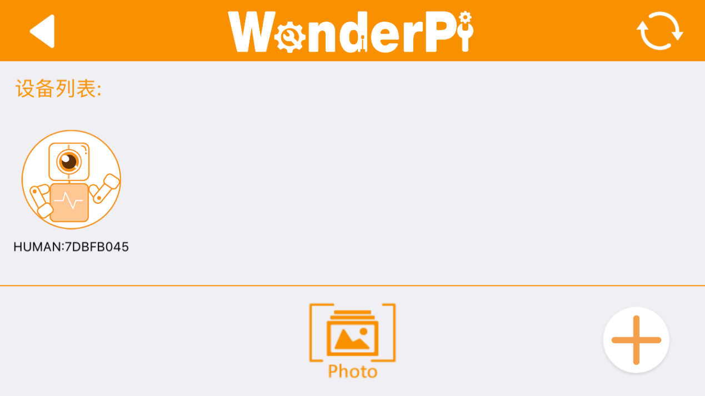

**!若手机弹窗提示“网络不可用，是否继续连接”之类的弹窗，单击“保持连接”即可。**

- #### 2.3局域网模式连接方法（选看）

1.  这里我们以连接了AP直连模式为基础。首先打开WonderPi，然后单击右下角“**+**”按钮，选择“**局域网模式**”，根据界面提示前往手机设置连接Wi-Fi。

    

    

2.  点击想要连接的Wi-Fi（这里以“Hiwonder”为例）。

    

3.  连接完成后返回APP，再次点击右下角“**+**”按钮，选择“**局域网模式**”。

4.  此时APP会提示输入你所连接Wi-Fi的密码（若没有自动弹出可再次点击“局域网模式”），输入完成点击“**下一步**”。（请确认Wi-Fi密码是否输入正确，如果输入错误会导致连接失败。）

    

5.  根据APP提示，再次前往设置，连接以“HW”开头的热点。

    

6.  连接热点后返回APP，此时可以看到APP已经开始自动连接了。连接过程中如出现是否加入的提示，点击“**加入**”即可。

    

    

7.  稍等片刻，界面会自动切回APP主界面，同时树莓派扩展板上的LED2将停止闪烁，和LED1一样保持常亮状态，此时即表示树莓派联网成功。

    

8.  长按APP中的人形机器人图标，可以查看分配给人形机器人的IP地址和ID（请记下此时设备的IP地址，后续步骤中需要用到）。

    

9.  接下来，请前往“**第6章 远程工具安装及连接\第1课 远程工具安装与连接**”课程，按照步骤安装VNC远程连接工具，然后在地址栏输入设备的IP地址，然后按下回车。

    

10. 此时弹出一个提示框，要求输入账号（Username）和密码（Password），账号输入：pi，密码输入：raspberry，勾选上记住密码框，然后单击“**OK**”，然后便可看到远程打开的树莓派的桌面了。

    
## **2.1 手机APP试玩**

**注意：本节以TonyPi Pro版本为例进行展开，内容一致适用于TonyPi其它版本。**

### 1.准备工作

参照“**第2章 上手试玩\第1课 手机APP安装和连接**”教程，安装手机APP，并连接**TonyPi Pro**机器人。

### 2.开始试玩

**注意：2.8 跨栏避障、2.9 上下台阶玩法仅为TonyPi Pro版本所适用。**

1)  点击机器人图标，进入到玩法选择的主界面。

    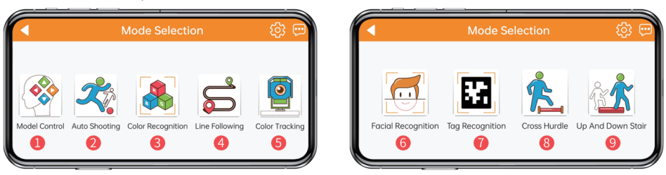

    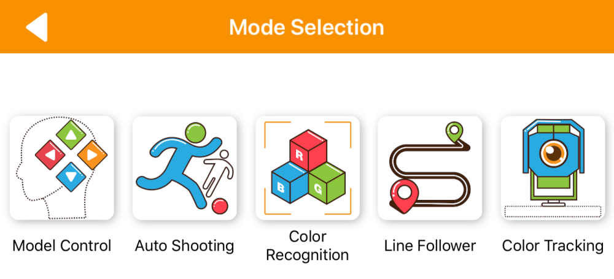

- #### 2.1机体遥控

1)  点击玩法图标“**机体遥控**”，然后便会进入对应界面，同时机器人将立即回归初始姿态。

    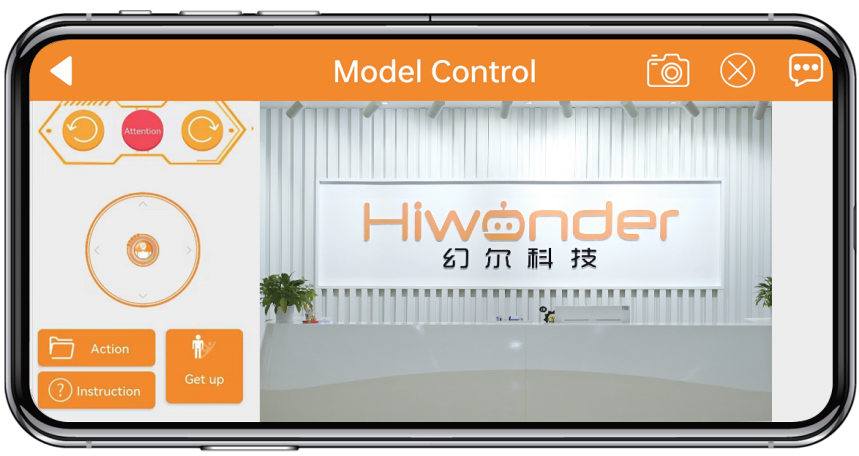

2)  “**机体遥控**”界面分为两部分，其中界面左侧可通过滑动摇杆来控制机器人移动，其它功能图标可参考下表：

| **图标** | **对应功能** |
|:--:|:--:|
|  | 操作摇杆可控制机器人移动。 |
|  | 可操控机器人向左移动、向右移动及立正。 |
|  | 可执行内置动作和跌倒起立功能。 |

界面右侧为摄像头回传的实时画面，拖动界面即可对摄像头进行转动。

**注意：摄像头头部舵机采取了限位保护。当转动至极限位置后，再次滑动屏幕会有震动反馈，此时请勿继续转动。**

3)  界面右下角的“**操作说明**”可供参考，具体内容如下图所示：

    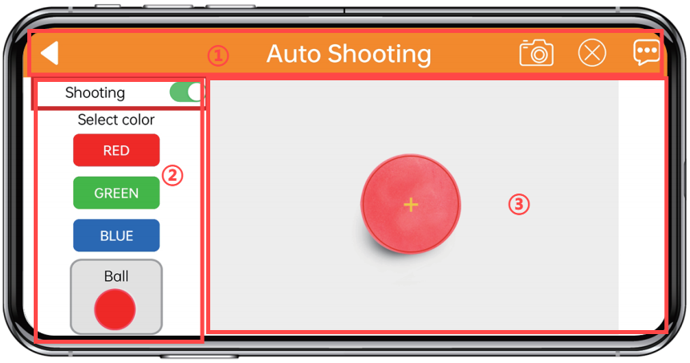

**每切换一次玩法功能，机器人均将回归初始姿态。**

4)  如需返回到玩法选择界面，点击空白区调出标题栏，再点击左侧的左三角即可。

- #### 2.2自动踢球

该玩法可以识别红、绿、蓝三种颜色的小球，TonyPi会调整位置靠近小球，并将其踢向前方

---

**注意：**

**1.  请在光线充足的室内环境下进行，但尽量避免在强光直射下进行。**

**2. 识别时，摄像头画面内请勿应无同目标颜色相同或相近的杂物，避免干扰识别。**

**3. 如识别效果不佳，可前往目录“第2章 上手试玩\第3课 颜色阈值调试”查看文档，学习颜色阈值的调节方式。**

---

1)  点击“**自动踢球**”，进入玩法界面。该界面分为三个部分：

    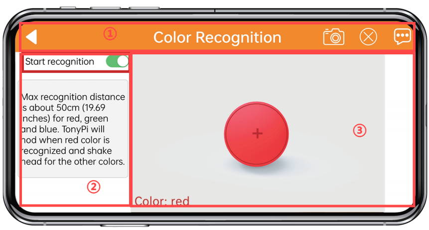

- **界面上方的是状态栏。**

- **界面左侧是玩法的开启。**

- **界面右侧是摄像头回传画面区域。**

2)  点击“**开始识别**”按钮，可依次将红色、蓝色、绿色的物体单独放置于摄像头前。以绿色为例，当识别到绿色时，TonyPi会在回传画面中将识别到的绿色框出来，靠近小球将小球踢走。

3)  如需返回到玩法选择界面，点击当前界面的空白区域，调出标题栏，随后点击按键即可。

- #### 2.3颜色识别

该玩法可以识别红、绿、蓝三种颜色，识别到红色点头，识别到蓝色或绿色摇头。

---

**注意：**

- **请在光线充足的室内环境下进行，但尽量避免在强光直射下进行。**

- **识别时，摄像头画面内请勿应无同目标颜色相同或相近的杂物，避免干扰识别。**

- **如识别效果不佳，可前往目录“第2章 上手试玩\第3课 颜色阈值调试”查看文档，学习颜色阈值的调节方式。**

---

1)  点击“**颜色识别**”，进入玩法界面。该界面分为三个部分：

    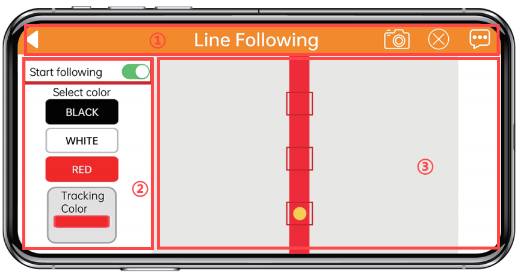

- **界面上方的是状态栏。**

- **界面左侧是玩法的开启、关闭。**

- **界面右侧是摄像头回传画面区域。**

点击“**开始识别**”按钮，可依次将红色、蓝色、绿色的物体单独放置于摄像头前。以绿色为例，当识别到绿色时，TonyPi会在回传画面中将识别到的绿色框出来，再执行“**摇头**”动作；并将识别到的颜色显示在左下角。

| **识别颜色** |         **识别结果**         |
|:------------:|:----------------------------:|
|      红      | 蜂鸣器“滴”一声，摄像头点头。 |
|      绿      | 蜂鸣器“滴”一声，摄像头摇头。 |
|      蓝      | 蜂鸣器“滴”一声，摄像头摇头。 |

2)  如需返回到玩法选择界面，点击当前界面的空白区域，调出标题栏，随后点击按键即可。

- #### 2.4 智能巡线

点击“**智能巡线**”，进入玩法界面。启动该玩法后，可以让TonyPi沿着黑线、白线或红线前进。

---

**注意：**

1.  **请在光线充足的室内环境下进行，但尽量避免在强光直射下进行。**

2.  **识别时，摄像头画面内请勿应无同目标颜色相同或相近的杂物，避免干扰识别。**

3.  **如识别效果不佳，可前往目录“第2章 上手试玩\第3课 颜色阈值调试”查看文档，学习颜色阈值的调节方式。**

---

- **界面上方的是状态栏。**

- **界面左侧是巡线开关和颜色选择区域。**

- **界面右侧是摄像头回传画面区域。**

1.  点击“**开始巡线**”按钮，并选择巡线颜色，TonyPi将沿着目标颜色的线条前进。

| **按钮图标** | **功能说明** |
|:--:|:--:|
| 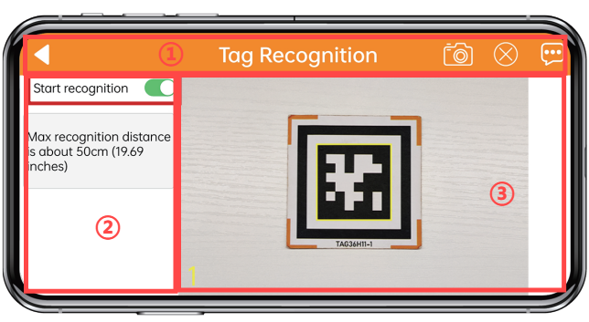 | 开启/关闭玩法。 |
| 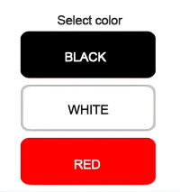 | 选择巡线目标颜色。 |
|  | 显示选中的颜色。 |

2.  如需返回到玩法选择界面，点击当前界面的空白区域，调出标题栏，随后点击按键即可。

- #### 2.5 颜色追踪

点击“**颜色追踪**”，进入玩法界面。该玩法开启后可以实现头部舵机随着目标的移动而移动的功能。

---

注意：

1.  **请在光线充足的室内环境下进行，但尽量避免在强光直射下进行。**

2.  **识别时，摄像头画面内请勿应无同目标颜色相同或相近的杂物，避免干扰识别。**

3.  **如识别效果不佳，可前往目录“第2章 上手试玩\第3课 颜色阈值调试”查看文档，学习颜色阈值的调节方式。**

---

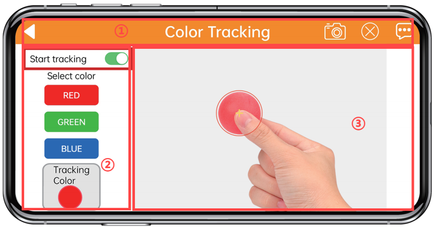

- 界面上方的是状态栏。

- 界面左侧是追踪开关和颜色选择区域。

- 界面右侧是摄像头回传画面区域。

1)  点击“**开始追踪**”按钮，再选择目标颜色即可启动追踪玩法，此时TonyPi的摄像头将跟随选定的颜色目标运动。

| **按钮图标** | **功能说明** |
|:--:|:--:|
| 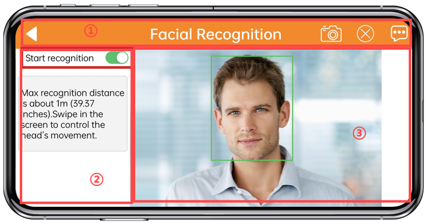 | 开启/关闭颜色追踪玩法。 |
|  | 选择追踪的目标颜色。 |
| 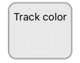 | 显示目标颜色信息。 |

2)  如需返回到玩法选择界面，点击当前界面的空白区域，调出标题栏，随后点击按键即可。

- #### 2.6 人脸识别

1.  点击“**人脸识别**”，进入玩法界面。摄像头将四周环绕移动，当识别到1m内的人脸，机器人将朝其招手。

    

- 界面上方的是状态栏。

- 界面左侧是人脸检测开关区域。

- 界面右侧是摄像头回传画面区域。

2.  点击“**开始识别**”按钮，头部舵机进行左右来回移动。

| **按钮图标** | **功能说明** |
|:--:|:--:|
|  | 开启/关闭玩法。 |

3.  如需返回到玩法选择界面，点击当前界面的空白区域，调出标题栏，随后点击按键即可。

- #### 2.7标签识别

点击“**标签识别**”识别，进入玩法界面。该玩法启动后可以让TonyPi识别不同的二维码，执行对应的动作。

---

**注意：**

1.  **识别二维码时距离不宜太近或太远，一般二维码图片与摄像头相距为35cm为最佳。**

2.  **请在光线充足的室内环境下进行，但尽量避免在强光直射下进行。**

---

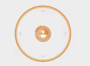

- 界面上方的是状态栏。

- 界面左侧是二维码开关及选择区域。

- 界面右侧是二维码画面。

1.  点击“**开始识别**”按钮，并选择不同的二维码，TonyPi将在识别到不同的二维码之后执行不同的动作。

| **按钮图标** | **功能说明** |
|:--:|:--:|
|  | 开启/关闭玩法。 |

2.  如需返回到玩法选择界面，点击当前界面的空白区域，调出标题栏，随后点击按键即可。

- #### 2.8跨栏越障

点击“**跨栏越障**”，进入玩法界面。摄像头将对台阶道具上的蓝色部分进行识别，并完成跨越的动作。

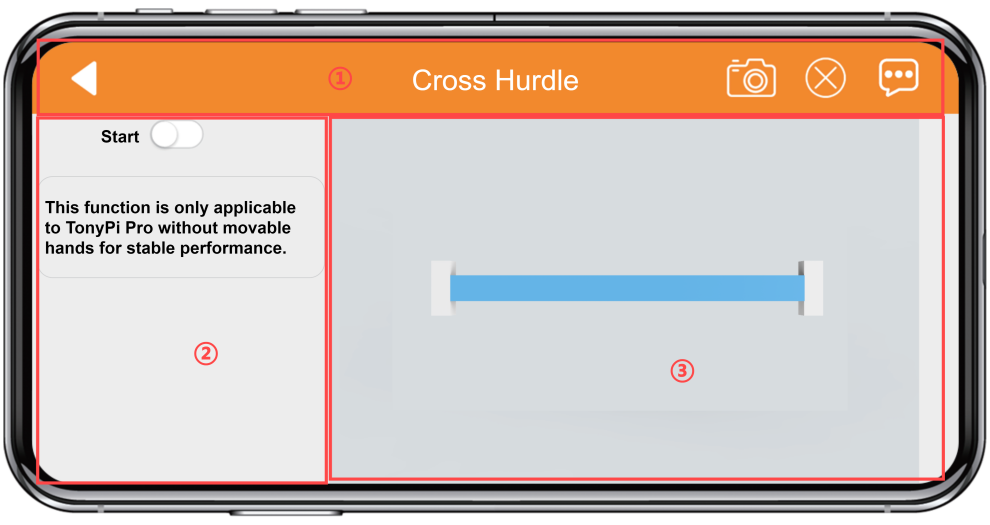

- 界面上方的是状态栏。

- 界面左侧玩法开关区域；

- 界面右侧是摄像头回传画面区域

1.  点击“**开始跨栏**”按钮，TonyPi检测到跨栏道具之后会跨过道具继续前进。

| **按钮图标** | **功能说明** |
|:--:|:--:|
|  | 开启/关闭玩法。 |

2.  如需返回到玩法选择界面，点击当前界面的空白区域，调出标题栏，随后点击按键即可。

- #### 2.9上下台阶

1.  点击“**开始**”，进入玩法界面。摄像头将对台阶道具上的红色部分进行识别，并完成上下台阶的动作。

    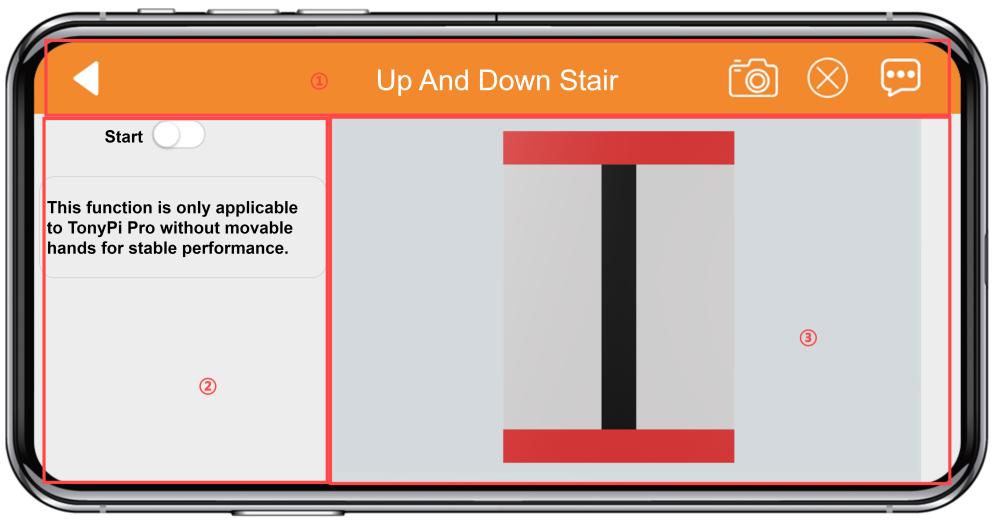

- 界面上方的是状态栏。

- 界面左侧玩法开关区域。

- 界面右侧是摄像头回传画面区域

2.  点击“**开始跨栏**”按钮，TonyPi检测到跨栏道具之后会跨过道具继续前进。

| **按钮图标** | **功能说明** |
|:--:|:--:|
|  | 开启/关闭玩法。 |

3.  如需返回到玩法选择界面，点击当前界面的空白区域，调出标题栏，随后点击按键即可。
## 3.1 颜色阈值调试

在不同光源下，物体颜色的呈现效果是不同的，而这一现象会对涉及颜色识别的功能玩法产生一定程度的影响。针对这一问题，本节课会学习如何使用手机APP“WonderPi”来调节颜色阈值。

### 1.准备工作

将机器人开机，安装手机APP“**WonderPi**”并连接机器人。如需了解具体操作步骤，可查看目录“**第2章 上手试玩\第1课 手机APP安装与连接**”下的教程。

### 2.界面介绍

进入玩法模式选择界面后，点击下图所示按键，即可进入颜色阈值调节界面。

下表是颜色阈值调节界面的功能说明：

<table>
<colgroup>
<col style="width: 35%" />
<col style="width: 64%" />
</colgroup>
<tbody>
<tr>
<td style="text-align: center;"><strong>图标</strong></td>
<td style="text-align: center;"><strong>功能说明</strong></td>
</tr>
<tr>
<td style="text-align: center;"></td>
<td style="text-align: left;">
摄像头回传画面的处理后图像。

图像中，颜色物体区域表示为白色，其余部分表现为黑色。
</td>
</tr>
<tr>
<td style="text-align: center;"></td>
<td style="text-align: left;">摄像头回传画面的原始图像。</td>
</tr>
<tr>
<td style="text-align: center;">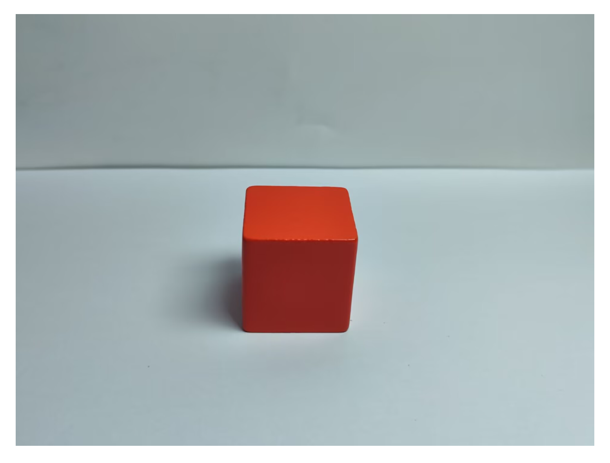</td>
<td style="text-align: left;">选择当前调节的颜色。</td>
</tr>
<tr>
<td style="text-align: center;"></td>
<td style="text-align: left;">
调节回传画面的L分量（白~黑）范围，“L_min”是范围下限，“L_max”是范围上限。

点击按键可减小对应数值，点击按键可增大数值。
</td>
</tr>
<tr>
<td style="text-align: center;"></td>
<td style="text-align: left;">
调节回传画面的A分量（绿~红）范围，“a_min”是范围下限，“a_max”是范围上限。

点击按键可减小对应数值，点击按键可增大数值。
</td>
</tr>
<tr>
<td style="text-align: center;"></td>
<td style="text-align: left;">
调节回传画面的B分量（黄~蓝）范围，“b_min”是范围下限，“b_max”是范围上限。

点击按键可减小对应数值，点击按键可增大数值。
</td>
</tr>
<tr>
<td style="text-align: center;"></td>
<td style="text-align: left;">打开操作说明窗口，可查看颜色阈值调节方法。</td>
</tr>
<tr>
<td style="text-align: center;"></td>
<td style="text-align: left;">保存调节的阈值。</td>
</tr>
<tr>
<td style="text-align: center;"></td>
<td style="text-align: left;">返回玩法模式选择界面。</td>
</tr>
<tr>
<td style="text-align: center;"></td>
<td style="text-align: left;">隐藏导航栏。</td>
</tr>
<tr>
<td style="text-align: center;"></td>
<td style="text-align: left;">显示幻尔科技的信息窗口。</td>
</tr>
</tbody>
</table>

### 3.调节颜色阈值

1.  进入颜色阈值调节界面，选择需要调节阈值的颜色，此处以红色为例。

2.  将红色物体放置在摄像头的视野范围内，将L、A、B分量的最小值都调为“**0**”，最大值都调为“**255**”。

3.  点击“**操作说明**”按键，查看颜色阈值的调节方法。

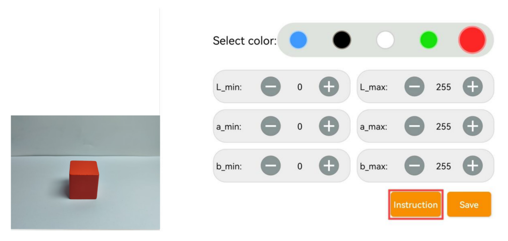

**注意：如需关闭操作说明窗口，点击“好的”即可。**

4.  由LAB颜色空间分布图可知，红色靠近“**+a**”，即需要优先调整A分量。

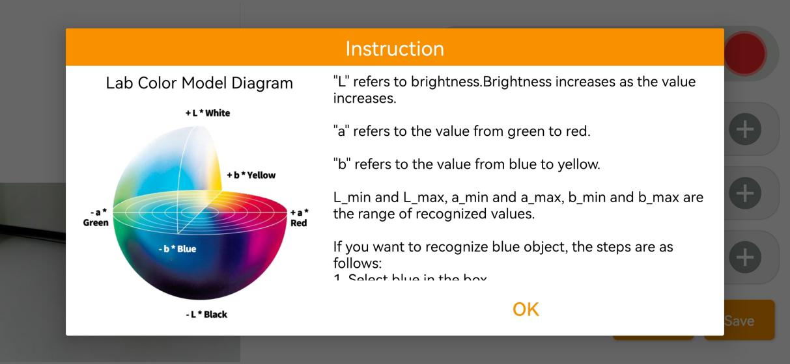

5.  “**a_max**”的数值保持不变，增大“**a_min**”的数值，直至处理后图像中的红色物体区域显示为白色，其余部分显示为黑色。

6.  根据所处环境来调整L分量和B分量。若红色物体在环境下颜色偏浅，增大亮度的最小值(**L_min**)；在环境下颜色偏深，则减小亮度的最大值(**L_max**)。若红色物体在环境下偏暖色调，增大色度的最小值(**b_min**)；在环境下偏冷色调，减小色度的最大值(**b_max**)。

7.  完成阈值调节后，点击“**保存**”按键，保存调节好的阈值范围。

